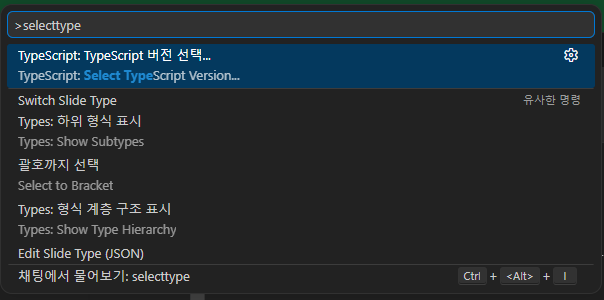
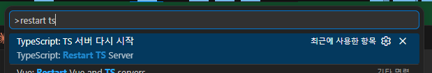

# [Root/README.md](../README.md)
# Vite React Typescript 프로젝트 설치 가이드

- vite 기반 설치
  ```bash
  npm create vite@6.5.0 onebite-react-ts-sns-app
  ```

- 뷰 프레임워크 선택 : `React`
  ```console
  > npx
  > cva onebite-react-ts-sns-app

  |
  *  Select a framework:
  |    Vanilla
  |    Vue
  |  > React
  |    Preact
  |    Lit
  |    Svelte
  |    Solid
  |    Qwik
  |    Angular
  |    Marko
  |    Others
  —
  ```

- 템플릿 선택: `TypeScript`
  ```console
  > npx
  > cva onebite-react-ts-sns-app

  |
  o  Select a framework:
  |  React
  |
  *  Select a variant:
  |  > TypeScript
  |    TypeScript + SWC
  |    JavaScript
  |    JavaScript + SWC
  |    React Router v7 ↗
  |    TanStack Router ↗
  |    RedwoodSDK ↗
  —
  ```
- 설치 완료 화면
  ```console
  > npx
  > cva onebite-react-ts-sns-app

  |
  o  Select a framework:
  |  React
  |
  o  Select a variant:
  |  TypeScript
  |
  o  Scaffolding project in C:\Users\dq\diquest\study\inflearn\onebite-react-ts-sns-app...
  |
  —  Done. Now run:

    cd onebite-react-ts-sns-app
    npm install
    npm run dev
  ```
- npm 의존성 설치
  ```bash
  npm install
  ```
- 로컬 node 기동
  ```bash
  npm run dev
  ```

# 설치 환경 분석

## vite 의존성 버전
vite 설치시 6.5.0 버전으로 설치되도록 명령어에 버전을 명시하였다.  
실제 package.json 파일에서 devDepndencies에 추가된 vite의 버전이 6.3.5로 설치된것을 확인할 수 있다.  

- package.json
  ```json
  {
    /* 생략 */
    "devDependencies": {
      /* 생략 */
      "vite": "^6.3.5"
    }
  }

  ```
이는 create vite 도구는 vite 그 자체가 아닌 vite로 구동되는 Rect앱을 생성하는 도구이기 때문이다.  
즉, create vite에서 @6.5.0은 vite의 버전이 아닌 create vite의 버전이 되는것이다.

## Typescript 설정
- [tsconfig.app.json](ONEBITE-EAXM/tsconfig.app.json)  
- [tsconfig.node.json](ONEBITE-EAXM/tsconfig.app.json)
- [tsconfig.json](ONEBITE-EAXM/tsconfig.app.json)

프로젝트를 세팅하게 되면 위와 같이 타입스크립트 설정 파일이 3개 구성된다.  
각 설정파일은 아래와 같은 역할을 갖는다.  

### [tsconfig.app.json](ONEBITE-EAXM/tsconfig.app.json)
app.json 이라는 이름에 걸맞게, React 앱에서 React 앱을 구동하기 위한 타입스크립트 옵션 파일이다.  
브라우저 환경에서만 실행되는 React 앱을 위한 코드들. 예를들어 컴포넌트 내부 함수 혹은 jsx 문법이 적용된 코드 등 브라우저 환경에서만 동작하는 코드들의 타입 스크립트 옵션을 설정하는 파일이다.  
파일 내용을 살펴보면 `compilerOptions` 항목 안에 여러가지의 타입스크립트 옵션이 설정되어 있는 것을 확인할 수 있다.  


### [tsconfig.node.json](ONEBITE-EAXM/tsconfig.app.json)
node.json 이라는 이름에 걸맞게, nodejs 환경에서 실행이되는 타입스크립트 코드들을 위한 옵션 파일이다.  
예를들어 테스트 코드처럼 Node.js 환경에서만 실행되고 브라우저에서는 실제로 실행되지 않는 코드들을 위한 옵션 설정 파일이다.  

### [tsconfig.json](ONEBITE-EAXM/tsconfig.app.json)
tsconfig.app.json과 tsconfig.node.json 2개의 설정파일을 각각 참조하는 래핑 파일이다.  
아래와 같이 파일 참조 설정만 존재한다.  
```json
{
  "files": [],
  "references": [
    { "path": "./tsconfig.app.json" },
    { "path": "./tsconfig.node.json" }
  ]
}
```
해당 설정에 의해 전체 프로젝트에 적용된다.  

### 이슈) ts 설정파일 파일 타입 오류
VSCode가 사용하는 타입스크립트의 버전과 실제 리액트 프로젝트가 사용하는 타입스크립트의 버전이 다를 경우 오류가 발생할 수 있다.  
1. `Ctrl + Shift + P` (~.config.json 파일에서 입력해야함.)
2. select typescript version 검색 및 선택
    
3. Vscode 버전과 작업영역 버전 중 작업영역 버전 선택.
4. `Ctrl + Shift + P`
5. restart ts server 검색 및 선택
    