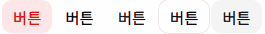
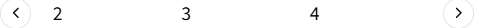
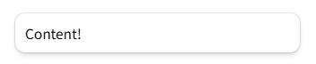
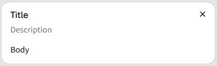
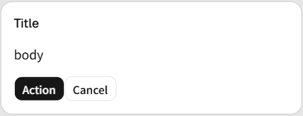
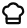
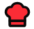

# [_**Root/README.md**_](../../README.md)

# _**Shadcn 실전 컴포넌트 적용 1**_
## 목차
1. button
2. input
3. textarea
4. sonner
<br>
<br>

<details>
<summary>접기/펼치기</summary>
<br>


## 1) button
아래와 같이 명령을 통해 컴포넌트를 추가할수 있으나, shadcn 초기 세팅시 기본으로 추가된다.
```bash
npx shadcn@latest add button
```

앞서 [SETTING.md](SETTING.md)에서 세팅 과정 중 마지막 기본 예제에 이어 variant 속성에 대해 적용해본다.  

### variant 속성
button의 스타일 유형을 조정할 수 있는 속성이다.

```tsx
import { Button } from "@/components/ui/button";

function Shadcn() {
  return (
    <div className="p-5">
      {/* 생략 */}
      <Button variant={"destructive"}>버튼</Button>
      <Button variant={"ghost"}>버튼</Button>
      <Button variant={"link"}>버튼</Button>
      <Button variant={"outline"}>버튼</Button>
      <Button variant={"secondary"}>버튼</Button>
    </div>
  );
}

export default Shadcn;
```



<br>


## 2) input
아래 명령을 통해 컴포넌트를 추가한다.
```bash
npx shadcn@latest add input
```

onChange, value 등 일반적인 input 태그와 동일하게 속성을 설정할 수 있다.

```tsx
import { Input } from "@/components/ui/input";

function Shadcn() {
  return (
    <div className="p-5">
      {/* 생략 */}
      <Input placeholder="입력 ..." />
    </div>
  );
}

export default Shadcn;
```
<br>


## 3) textarea
아래 명령을 통해 컴포넌트를 추가한다.
```bash
npx shadcn@latest add textarea
```

```tsx
import { Textarea } from "@/components/ui/textarea";

function Shadcn() {
  return (
    <div className="p-5">
      {/* 생략 */}
      <Textarea />
    </div>
  );
}

export default Shadcn;
```
<br>

## 4) sonner
버튼을 클릭하는 등 이벤트가 발생했을때, 혹은 원하는 타이밍에 Toast 메시지를 발생시키는 컴포넌트이다.  

아래 명령을 통해 설치한다.  

```bash
npx shadcn@latest add sonner
```

Toast 메시지가 실제 렌더링이 될 Toaster 컴포넌트를 import하여 jsx에 배치시킨 후, sonner가 제공하는 toast 함수를 import 하여 메시지와 옵션을 전달하여 호출하면 된다.  

```tsx
import { Toaster } from "@/components/ui/sonner";
import { toast } from "sonner";

function Shadcn() {
  return (
    <div className="p-5">
      {/* 생략 */}
      <Toaster />
      <Button
        onClick={() => {
          toast("버튼이 클릭되었습니다.");
        }}
      >
        sonner 버튼
      </Button>
    </div>
  );
}

export default Shadcn;
```

toast 옵션은 두번째 매개변수로 객체 형태로 전달한다.  

```tsx
import { Toaster } from "@/components/ui/sonner";
import { toast } from "sonner";

function Shadcn() {
  return (
    <div className="p-5">
      {/* 생략 */}
      <Toaster />
      <Button
        onClick={() => {
          toast("버튼이 클릭되었습니다.", {
            position: "top-center",
          });
        }}
      >
        sonner 버튼
      </Button>
    </div>
  );
}

export default Shadcn;
```
<br>

</details>
<br>
<hr>
<br>

# _**Shadcn 실전 컴포넌트 적용 2**_
## 목차

1. carousel
2. popover
3. dialog
4. alert-dialog
5. icon
<br>
<br>

<details>
<summary>접기/펼치기</summary>
<br>

## 1) carousel
이미지 슬라이드 등에 주로 활용되는 컴포넌트이다.  



아래 명령을 통해 설치한다.  
```bash
npx shadcn@latest add carousel
```

### 컴파운드(합성) 컴포넌트 패턴
Carousel이라는 최상위 컴포넌트 하위로 여러개의 컴포넌트, 그리고 하위 컴포넌트 내에서도 자식 컴포넌트를 구성하는 컴파운드(합성) 컴포넌트 방식으로 구성된다.

- Shadcn.tsx
  ```tsx
  import {
    Carousel,
    CarouselContent,
    CarouselItem,
    CarouselNext,
    CarouselPrevious,
  } from "@/components/ui/carousel";

  function Shadcn() {
    return (
      <div className="p-5">
        <Carousel>
          <CarouselContent>
            <CarouselItem>1</CarouselItem>
            <CarouselItem>2</CarouselItem>
            <CarouselItem>3</CarouselItem>
            <CarouselItem>4</CarouselItem>
            <CarouselItem>5</CarouselItem>
          </CarouselContent>
          <CarouselPrevious />
          <CarouselNext />
        </Carousel>
      </div>
    );
  }

  export default Shadcn;
  ```

- **Carousel :** Carousel의 최상위 컴포넌트
  - **CarouselContent :** CarouselItem을 랩핑하는 컴포넌트
    - **CarouselItem :** 실제 출력될 요소
  - **CarouselPrevius :** 이전 CarouselItem을 출력한다.
  - **CarouselNext :** 다음 CarouselItem을 출력한다.

Carousel 방향키 컴포넌트인 CarouselPrevious, CarouselNext는 Carousel 바깥쪽에 absolute로 배치된다.  
따라서 Carousel이 화면 너비를 가득 차지하면 방향키가 화면 밖으로 밀려나 보이지 않을 수 있다.  
Tailwind CSS의 mx-10을 적용하여 좌우에 2.5rem(40px)의 여백을 확보하면, 바깥쪽에 배치된 방향키가 화면 안에 표시된다.  

```tsx
{/* 생략 */}
<Carousel className="mx-10">
  {/* 생략 */}
</Carousel>
```

한 화면에 하나의 아이템이 아닌 여러개의 아이템이 보이도록 하기위해서 basis-1/3 클래스를 통해 현재 너비의 3분의 1만큼 차지하도록 컴포넌트의 사이즈를 줄일 수 있다.  
해당 클래스는 flex-basis: calc(1/3 * 100%) = 33.3333% 로 적용된다.  

```tsx
{/* 생략 */}
<Carousel className="mx-10">
  <CarouselContent>
    <CarouselItem className="basis-1/3">1</CarouselItem>
    <CarouselItem className="basis-1/3">2</CarouselItem>
    <CarouselItem className="basis-1/3">3</CarouselItem>
    <CarouselItem className="basis-1/3">4</CarouselItem>
    <CarouselItem className="basis-1/3">5</CarouselItem>
  </CarouselContent>
  {/* 생략 */}
</Carousel>
```

## 2) popover
버튼의 하단에 조그만 창이 출력되며, 창 바깥을 클릭하면 닫힌다.  



사용자 메뉴 같은 프로필 사진을 클릭하면 로그아웃, 설정 등으로 이동할 수 있게 해주는 드롭다운 형태의 UI를 표현할 때 활용된다.  

아래 명령을 통해 설치한다.  
```bash
npx shadcn@latest add popover
```

- Shadcn.tsx
  ```tsx
  import {
    Popover,
    PopoverContent,
    PopoverTrigger,
  } from "@/components/ui/popover";

  function Shadcn() {
    return (
      <div className="p-5">
        <Popover>
          <PopoverTrigger>Open</PopoverTrigger>
          <PopoverContent>Content!</PopoverContent>
        </Popover>
      </div>
    );
  }

  export default Shadcn;
  ```

- **Popover :** 컴파운드 컴포넌트 패턴으로 구성된 최상위 컴포넌트
- **PopoverTriger :** Popover 창을 여는 버튼 역할
- **PopoverContent :** 실제 출력되는 Popover 창 역할


### asChild
PopoverTrigger 컴포넌트가 자체적으로 새로운 버튼을 생성하지 않고 자식 요소로 전달된 컴포넌트를 그대로 Trigger 역할로 사용하게 해주는 props 속성으로,  
생략할 경우 PopoverTrigger 버튼이 렌더링 되고 자식 요소로 구성한 태그는 아무런 동작을 하지 않는 상태로 생성된다.
          
```tsx
import {
  Popover,
  PopoverContent,
  PopoverTrigger,
} from "@/components/ui/popover";

function Shadcn() {
  return (
    <div className="p-5">
      <Popover>
        <PopoverTrigger>Open</PopoverTrigger>
        <PopoverTrigger asChild>
          {/* <Button>asChild</Button> */}
          <div>asChild</div> {/* div 태그도 트리거 동작 */}
        </PopoverTrigger>
        <PopoverContent>Content!</PopoverContent>
      </Popover>
    </div>
  );
}

export default Shadcn;
```

## 3) dialog
모달이라고도 불리우는 컴포넌트이다.  
버튼을 누르면 모달 형태의 Dialog가 열리고, 바깥을 누르면 닫힌다.  



Popover 컴포넌트와 동일하게 컴파운드 컴포넌트 패턴이며, Trigger역할을 해주는 하위 컴포넌트가 필요하다.  

아래 명령을 통해 설치한다.  
```bash
npx shadcn@latest add dialog
```

- Shadcn.tsx
  ```tsx
  import {
    Dialog,
    DialogContent,
    DialogDescription,
    DialogHeader,
    DialogTitle,
    DialogTrigger,
  } from "@/components/ui/dialog";

  function Shadcn() {
    return (
      <div className="p-5">
        <Dialog>
          <DialogTrigger>Open Dialog</DialogTrigger>
          <DialogContent>
            <DialogHeader>
              <DialogTitle>Title</DialogTitle>
              <DialogDescription>Description</DialogDescription>
            </DialogHeader>
            <div>Body</div>
          </DialogContent>
        </Dialog>
      </div>
    );
  }

  export default Shadcn;
  ```

  - **Dialog :** 컴파운드 컴포넌트 패턴으로 구성된 최상위 컴포넌트
    - **DialogTrigger :** Dialog 창을 여는 버튼 역할 
    - **DialogContent :** 실제 출력되는 Dialog 창 역할로 Title과 Description을 자식컴포넌트로 배치할 수 있는 DialogHeader 컴포넌트를 하위로 구성한다.
      - **DialogHeader**
        - **DialogTitle**
        - **DialogDescription**

    위 컴포넌트 외 Footer, Close 등의 전용 컴포넌트등도 지원한다.

### open
open props로 boolean값을 전달하여 원하는 타이밍에 Dialog나 Popover 렌더링 제어가 가능 하다.  
- **Dialog**  
  ```tsx
  import {
    Dialog,
    DialogContent,
    DialogDescription,
    DialogHeader,
    DialogTitle,
    DialogTrigger,
  } from "@/components/ui/dialog";

  function Shadcn() {
    return (
      <div className="p-5">
        <Dialog open={false}>
          <DialogContent>
            <DialogHeader>
              <DialogTitle>Title</DialogTitle>
              <DialogDescription>Description</DialogDescription>
            </DialogHeader>
            <div>Open Dialog true</div>
          </DialogContent>
        </Dialog>
      </div>
    );
  }

  export default Shadcn;
  ```
- **popover**  
  Popover는 PopoverContent가 표시될 위치의 기준점인 PopoverTrigger 또는 PopoverAnchor가 필요하다.  
  ```tsx
  import {
    Popover,
    PopoverContent,
    PopoverTrigger,
  } from "@/components/ui/popover";

  function Shadcn() {
    return (
      <div className="p-5">
        <Popover open={false}>
          <PopoverTrigger>Open</PopoverTrigger>
          <PopoverContent>Open Popover true!</PopoverContent>
        </Popover>
      </div>
    );
  }

  export default Shadcn;
  ```

## 4) alert-dialog

브라우저 순기능인 confirm과 같이 확인/취소 기능의 버튼을 추가할 수 있는 Dialog이다.  
확인/취소 버튼에 onClick 이벤트를 등록하여 활용 가능하다.  



아래 명령을 통해 설치한다.  
```bash
npx shadcn@latest add alert-dialog
```
- Shadcn.tsx
  ```tsx
  import {
    AlertDialog,
    AlertDialogAction,
    AlertDialogCancel,
    AlertDialogContent,
    AlertDialogTitle,
    AlertDialogTrigger,
  } from "@/components/ui/alert-dialog";

  function Shadcn() {
    return (
      <div className="p-5">
        <AlertDialog>
          <AlertDialogTrigger>Open Alert Dialog</AlertDialogTrigger>
          <AlertDialogContent>
            <AlertDialogTitle>Title</AlertDialogTitle>
            <div>body</div>
            <div>
              <AlertDialogAction onClick={() => console.log("Action!")}>
                Action
              </AlertDialogAction>
              <AlertDialogCancel onClick={() => console.log("Cancel!")}>
                Cancel
              </AlertDialogCancel>
            </div>
          </AlertDialogContent>
        </AlertDialog>
      </div>
    );
  }

  export default Shadcn;
  ```

  - **AlertDialog :** 컴파운드 컴포넌트 패턴으로 구성된 최상위 컴포넌트
  - **AlertDialogTrigger :** Alert Dialog 창을 여는 버튼 역할
  - **AlertDialogContent :** 출력되는 Dialog 창 역할로 Title과 Description 뿐만 아니라 확인/취소 역할을 하는 AlertDialogAction, AlertDialogCancel 컴포넌트를 각각 자식컴포넌트로 배치할 수 있다. (헤더 하위로 구성할 수 있으나, 헤더 생략이 가능하다.)
    - **AlertDialogAction :** 확인 버튼 역할. 즉, 버튼 클릭시 실행을 하는 역할을 하며, 이벤트를 할당할 수 있다.
    - **AlertDialogCancel :**  취소 버튼 역할. 버튼 클릭시 Dialog가 닫히며, 취소에 대한 콜백 이벤트를 발생시킬 수 있다.


## 5) icon

shadcn ui는 기본적으로 설치와 동시에 Lucide라는 아이콘 팩을 함께 제공하고 있다.  
별도의 아이콘 라이브러리를 이용하지 않아도 기본적인 아이콘을 lucide-react로 부터 불러오면 된다.  
[lucide-react icons](https://lucide.dev/icons)

아래 명령을 통해 설치한다.  
```bash
npx shadcn@latest add icon
```

- Shadcn.tsx  
  ```tsx
  import { ChefHat } from "lucide-react";

  function Shadcn() {
    return (
      <div className="p-5">
        <ChefHat />
      </div>
    );
  }

  export default Shadcn;
  ```
    


SVG 형태로 렌더링 되기 때문에 svg 태그에 적용할 수 있는 tailwindcss 클래스, 스타일들을 적용할 수 있다.



```tsx
<ChefHat className="h-10 w-10 fill-red-500" />
```


</details>