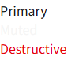

# [_**Root/README.md**_](../../README.md)

# _**Shadcn/Ui 설치 및 설정**_

## 1) TypeScript 경로 alias 설정

TypeScript가 `@/...` import 경로를 `src/...` 경로로 인식할 수 있도록 설정한다.  
이 설정은 VS Code의 자동완성, 경로 이동, 타입 검사에서 `@` alias를 정상적으로 해석하게 해준다.

- tsconfig.json / tsconfig.app.json
  ```json
  {
    /* 생략 */
    "compilerOptions": {
      "baseUrl": ".",
      "paths": {
        "@/*": ["./src/*"]
      }
    }
  }
  ```

`paths` 설정은 TypeScript와 에디터가 import 경로를 이해하기 위한 설정이다.  
즉 아래처럼 작성한 import를:

```ts
import Button from "@/components/ui/button";
```

TypeScript는 다음 경로처럼 해석한다.

```ts
import Button from "./src/components/ui/button";
```


### TypeScript v6.0 `baseUrl` 옵션 Deprecated 이슈

TypeScript 6.0부터 `baseUrl` 옵션은 deprecated 경고가 발생하며, TypeScript 7.0에서는 동작하지 않을 예정이다.

기존 Vite/shadcn 문서에서는 `paths`와 함께 `baseUrl`을 설정하는 예제가 많지만, TypeScript 4.1 이후부터는 `paths`를 사용하기 위해 `baseUrl`이 필수는 아니다.

따라서 `@/*` alias 설정에서는 `baseUrl`을 제거하고 `paths`만 유지한다.
- tsconfig.json / tsconfig.app.json
  ```json
  {
    "compilerOptions": {
      "paths": {
        "@/*": ["./src/*"]
      }
    }
  }
  ```

<br>
<hr>
<br>

## 2) Vite `@` alias 등록

Vite 번들러가 `@/...` import 경로를 실제 `src/...` 파일 경로로 변환할 수 있도록 설정한다.  
TypeScript 설정이 에디터와 타입 검사에서 경로를 인식하게 해준다면, Vite 설정은 개발 서버와 빌드 과정에서 실제 모듈을 찾게 해준다.

`vite.config.ts`에서 Node의 `path` 모듈을 사용하므로 Node 타입 정의가 필요하다.

```bash
npm install -D @types/node
```

- vite.config.ts

  ```ts
  /* 생략 */
  import path from "path";

  export default defineConfig({
    /* 생략 */
    resolve: {
      alias: {
        "@": path.resolve(__dirname, "./src"),
      },
    },
  });
  ```

`resolve.alias`의 의미는 `@`를 프로젝트의 `src` 폴더로 매핑한다는 뜻이다.  
따라서 Vite는 아래 import를:

```ts
import Button from "@/components/ui/button";
```

실제 파일 경로 기준으로 다음처럼 해석할 수 있다.

```ts
import Button from "./src/components/ui/button";
```

### TypeScript alias와 Vite alias의 차이

두 설정은 모두 `@`를 `src` 폴더로 연결하기 위한 설정이지만, 적용되는 대상이 다르다.

- `tsconfig.json` / `tsconfig.app.json`의 `paths`
  - TypeScript와 VS Code가 `@/...` import 경로를 이해하기 위한 설정이다.
  - 자동완성, 경로 이동, 타입 검사에서 사용된다.

- `vite.config.ts`의 `resolve.alias`
  - Vite가 개발 서버 실행과 빌드 과정에서 `@/...` import 경로를 실제 파일 경로로 해석하기 위한 설정이다.
  - 브라우저에서 모듈을 로드하거나 번들링할 때 사용된다.

따라서 같은 alias를 등록하는 것처럼 보이지만, TypeScript용 설정과 Vite용 설정을 각각 추가해야 에디터와 실행 환경이 모두 같은 경로를 인식할 수 있다.

## 3) shadcn 초기화

```bash
npx shadcn@latest init
```

1. "Select a component library"라는 질문이 나오면 `Radix UI`를 선택한다.

2. "Which preset would you like to use?"라는 질문이 나오면 기본값인 `Nova`를 선택한다.

```bash
Need to install the following packages:
shadcn@4.13.1
Ok to proceed? (y) y

✔ Select a component library › Radix UI
✔ Which preset would you like to use? › Nova
✔ Preflight checks.
✔ Verifying framework. Found Vite.
✔ Validating Tailwind CSS. Found v4.
✔ Validating import alias.
✔ Writing components.json.
✔ Checking registry.
✔ Installing dependencies.
✔ Created 2 files:
  - src\components\ui\button.tsx
  - src\lib\utils.ts
✔ Updating src\index.css

Project initialization completed.
You may now add components.
```

## 4) 초기화 후 변경 사항 및 적용 가이드

### A) components.json
Shadcn UI 라이브러리를 위한 설정파일로 Shadcn UI에서 제공하는 버튼이나 input 같은 UI 컴포넌트들을 추가 설치할 때 어떤 방식으로 설치할지 결정하는 기준이 된다.  

```json
{
  "$schema": "https://ui.shadcn.com/schema.json",
  "style": "radix-nova",
  "rsc": false,
  "tsx": true,
  "tailwind": {
    "config": "",
    "css": "src/index.css",
    "baseColor": "neutral",
    "cssVariables": true,
    "prefix": ""
  },
  "iconLibrary": "lucide",
  "rtl": false,
  "aliases": {
    "components": "@/components",
    "utils": "@/lib/utils",
    "ui": "@/components/ui",
    "lib": "@/lib",
    "hooks": "@/hooks"
  },
  "menuColor": "default",
  "menuAccent": "subtle",
  "registries": {}
}
```

Shadcn UI 라이브러리는 보통의 UI 라이브러리들과는 다르게 전체 컴포넌트를 한꺼번에 일괄적으로 설치하는 방식으로 설치되는것이 아닌, 필요한 컴포넌트만 선택적으로 설치하는 방식을 사용한다.  

에를들어 전통적인 UI 라이브러리인 Material UI나 혹은 Bootstrap 같은 라이브러리를 설치하게 되면, 해당 라이브러리가 제공하는 Input, Button, Textarea 등의 컴포넌트들이 일괄적으로 한꺼번에 설치가 되지만  
Shadcn UI는 각 컴포넌트들을 개별적으로 직접 개별 명령어를 통해 설치를 진행해야 한다.  

앞선 과정은 단순한 전체 셋업 과정이였고, 이후 부터는 셋업된 기준에 따라 컴포넌트를 추가로 하나씩 설치할 수 있다.  
이와같이 Shadcn UI는 프로젝트에 필요한 컴포넌트만 설치하므로, 전체 프로젝트의 용량이 가벼워진다는 이점도 누릴 수 있다.  

### B) ui/button.tsx
Shadcn UI 라이브러리를 설치(초기화) 하며 설치된 기본 컴포넌트이다.
과거에는 `npx shadcn@latest add button` 명령어로 추가로 설치해야한다.
components.json 파일에 설정된 aliases 속성 하위의 ui 속성에 정의된 경로에 설치된다.  
- components.json
  ```json
  {
    /* 생략 */
    "aliases": {
      /* 생략 */
      "ui": "@/components/ui",
      /* 생략 */
    },
    /* 생략 */
  }
  ```

Button 컴포넌트는 `named export` 방식으로 2개를 export 한다.
첫번째 요소는 `Button` 으로 실제 화면에 렌더링하는 버튼 React 컴포넌트 이며,  
두번째 요소는 `buttonVariants`로 Button 컴포넌트에 전달되는 `variant`와 `size` props 값에 따라 알맞은 Tailwind CSS 클래스 문자열을 만드어 반환하는 함수(cva) 이다.  
(buttonVariants를 따로 내보내는 이유는 `Button 컴포넌트를 사용하지 않고 anchor 혹은 division과 같은 다른 요소를 사용하면서 Button과 동일한 스타일만 입히고 싶을 때 클래스만 뽑아 쓰기 위함이다.`)
따라서 `{ 컴포넌트명 }` 형태로 필요한것만 골라 import 한다.
- button.tsx
  ```tsx
  /* 생략 */
  const buttonVariants = cva(/* 생략: variant·size별 Tailwind 클래스 정의 */)

  function Button({/* 생략 */})

  export { Button, buttonVariants }
  ```

- App.tsx
  ```tsx
  /* 생략 */
  import { Button } from "@/components/ui/button"
  /* 생략 */
  function App() {
    return (
      <div>
        <Button>버튼!</Button>
      </div>
    );
  }

  export default App;
  ```


### C) src/index.css 변경
기존 vite 기반 react 프로젝트에 구성되어있던 index.css 파일에 여러 색상값들에 대한 css 변수들이 자동으로 생성되었으며, 일반적인 Tailwind CSS를 사용하는 상황에서도 그대로 이용이 가능하다.  

- App.tsx
  ```tsx
  /* 생략 */
  import { Button } from "@/components/ui/button"
  /* 생략 */
  function App() {
    return (
      <div>
        <div className="text-primary">Primary</div>
        <div className="text-muted">Muted</div>
        <div className="text-destructive">Destructive</div>
      </div>
    );
  }

  export default App;
  ```


결론적으로 Shadcn UI 라이브러리를 설치하면, index.css에 여러 가지 색상들이 자동으로 팔레트처럼 CSS 변수로서 자동 설정된다.  
그리고 이렇게 설정된 색상은 Tailwind CSS에서 직접 사용할 수도 있어, 웹 개발 시 굉장히 편리하도록 팔레트를 제공해 주는 기능을 갖고 있다.  

이러한 색상값들은 이후 추가로 설치하게 될 Shadcn UI 컴포넌트 들에도 자동으로 적용이 된다.  


### D) src/lib/utils.ts
```ts
import { clsx, type ClassValue } from "clsx"
import { twMerge } from "tailwind-merge"

export function cn(...inputs: ClassValue[]) {
  return twMerge(clsx(inputs))
}
```
위와같이 cn이라는 함수가 선언되어 export로 내보내진다.  
이떄 cn 함수의 역할은 Tailwind CSS의 클래스들을 보다 편리하게 작성할 수 있도록 도와주는 일종의 헬퍼 함수이다.  

매개변수 inputs로 여러개의 className들을 받아와 clsx, twMerge 등의 추가적인 메서드들을 통해 충돌 없이 안정적으로 적용될 수 있는 className으로 변환해주는 역할을 한다.  

- App.tsx
  ```tsx
  /* 생략 */
  import { cn } from "@/lib/utils";
  const isActive = true;
  /* 생략 */
  function App() {
    return (
      <div>
        <div className={cn(isActive ? "text-green-500" : "text-red-500")}>
      </div>
    );
  }

  export default App;
  ```
위 예제는 isActive 변수 값이 true일 경우 `text-green-500` 클래스가 적용되며  만약 `const isActive = false`로 isActive 값이 변경되면 `text-red-500`으로 클래스가 변경되어 isActive 텍스트 노드에 빨간색이 적용된다.  

위와같이 특정 조건에 따라 클래스를 유동적으로 설정해 줘야 하는 경우에 자주 활용이 된다.  

또한 아래처럼 여러개의 css 클래스를 콤마 구분으로 전달하여 하나의 문자열로 병합해주는 기능또한 갖고 있다.  
```js
cn(
  "w-10",
  "text-sm",
  isActive ? "text-green-500" : "text-red-500"
)
```
