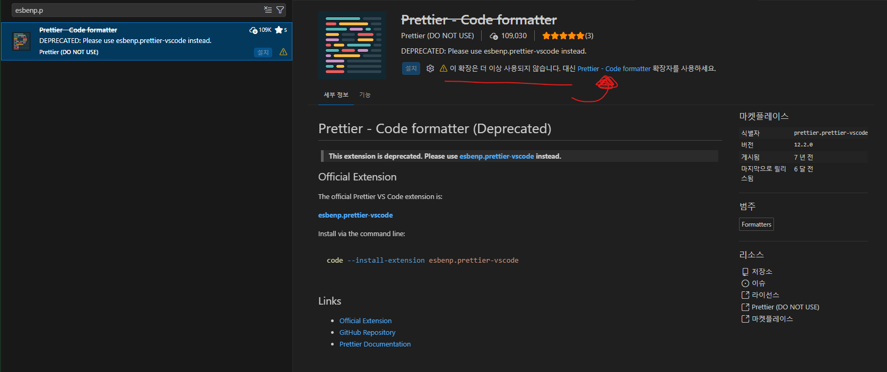
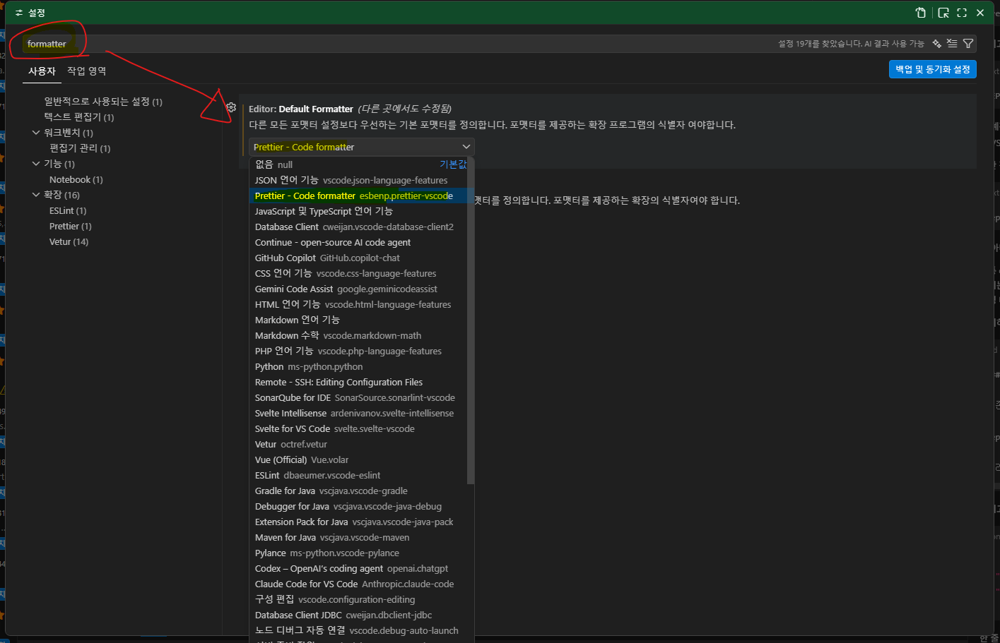

# [_**Root/README.md**_](../../README.md)

# [_**Tailwind css란?**_](ABOUT.md)

# TailwindCSS 설치 및 설정
<details>
<summary>접기/펼치기</summary>
<br>

### [TailwindCSS 공식문서](https://tailwindcss.com/)
vite 기반 React 프로젝트이기 때문에 vite 기반으로 설치한다.


- vite용 tailwindcss 의존성 설치
  ```bash
  npm install tailwindcss @tailwindcss/vite
  ```

- vite 설정: plugin 등록  
  - vite.config.ts
    ```ts
    import { defineConfig } from 'vite'
    import tailwindcss from '@tailwindcss/vite' // 추가

    export default defineConfig({
      plugins: [
        // 생략
        tailwindcss(), // 추가
      ]
    })
    ```
  vite.config.ts 파일은 Vite 프로젝트의 설정 파일로 `개발 서버 설정`, `빌드 설정`, `플러그인(빌드도구) 설정` 등을 관리한다. 
    여기서 플러그인은 Vite가 사용할 확장 기능 목록을 가리키며 Tailwind CSS의 플러그인을 등록해줌으로써, 
    빌드시에 Vite가 각 컴포넌트 들이 사용중인 Tailwind CSS 클래스들만 찾아 최종 산출물(CSS파일)에 구성하게 된다. 

- Tailwind CSS import

  - src/index.css
    ```css
    @import "tailwindcss";
    ```
    여러가지 유틸 클래스들을 제공하는 Tailwind CSS의 전역 CSS 파일이다.  
    해당 CSS파일을 import함으로써 Tailwind CSS의 모든 유틸 클래스들을 불러와 사용할 수 있게 된다.

### VSCode 확장프로그램 설치
- Tailwind CSS IntelliSense 
  자동완성, 린팅, 호버 프리뷰(도움말) 

### Prettier 플러그인 설정


1. prettier-plugin-tailwindcss 의존성 설치
    ```bash
    npm install -D prettier prettier-plugin-tailwindcss
    ```


2. .prettierrc 파일 생성 및 설정
    - src/.prettierrc
      ```json
      {
        "plugins": ["prettier-plugin-tailwindcss"]
      }
      ```

prettier를 사용하게 되면 className 속성에 정의한 class들의 순서가 자동으로 정렬된다.


- BEFORE
  ```tsx
  import './App.css'

  function App() {
    return <div className='font-bold underline  text-3xl'>Hello World</div>
  }

  export default App
  ```

- AFTER
  ```tsx
  import './App.css'

  function App() {
    return <div className='text-3xl font-bold underline'>Hello World</div>
  }

  export default App
  ```

레이아웃과 관련된 경우 앞으로, text스타일링과 관련되었을 경우 뒤로 정렬된다.

- BEFORE  
  레이아웃 배경색을 검정색으로 지정하는 bg-black를 가장 마지막에 추가.
  ```tsx
  import './App.css'

  function App() {
    return <div className='text-3xl font-bold underline bg-black'>Hello World</div>
  }

  export default App
  ```

- AFTER  
  bg-black이 가장 앞으로 이동.
  ```tsx
  import './App.css'

  function App() {
    return <div className='bg-black text-3xl font-bold underline'>Hello World</div>
  }

  export default App
  ```

### Prettier VS Code 확장 Deprecated 이슈

기존 `prettier.prettier-vscode` 확장이 deprecated 되었을 경우 동작하지 않는 현상이 발생할 수 있다.  
현재는 공식 확장인 `esbenp.prettier-vscode` 사용이 권장된다.

deprecated 확장이 설치되어 있으면 VS Code의 `editor.defaultFormatter` 후보에 Prettier가 정상적으로 표시되지 않거나, 저장 시 포맷이 동작하지 않을 수 있다.

따라서 기존 deprecated 확장은 사용하지 않고 `esbenp.prettier-vscode`를 설치한 뒤 아래처럼 설정한다.

1. **vscode extension에서 `esbenp.prettier` 검색**
   

- 우측 링크에 접속하여 새로 설치.

2. **VSCode Formatter 설정**
   

- 혹은

  ```json
  {
    /* 생략 */
    "editor.formatOnSave": true,
    "editor.defaultFormatter": "esbenp.prettier-vscode"
  }
  ```

  </details>
  <br>
