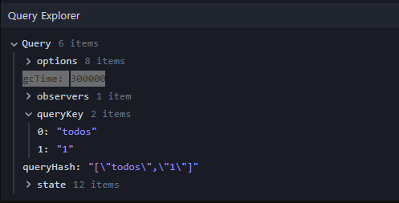
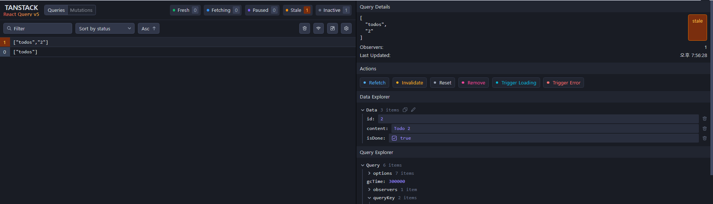
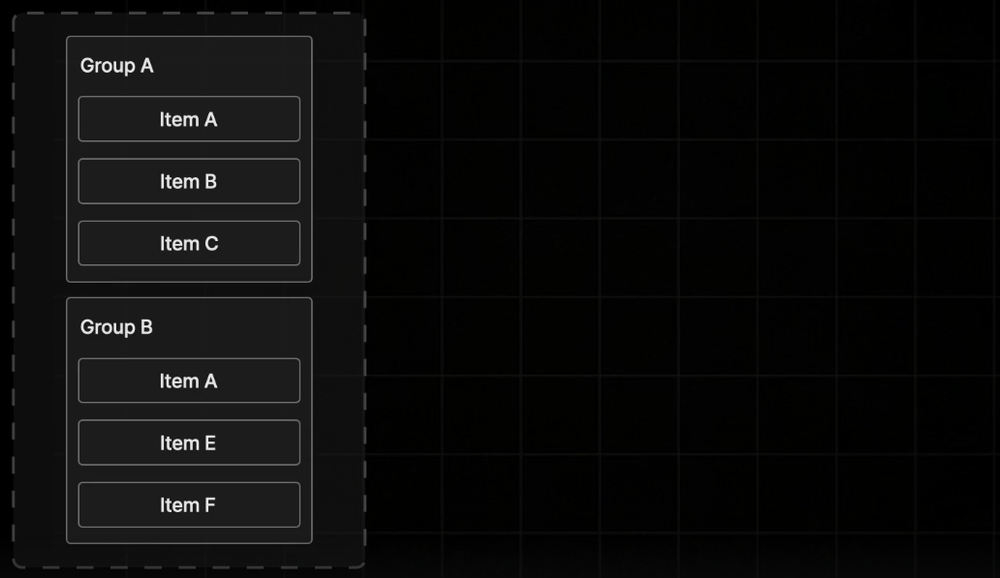
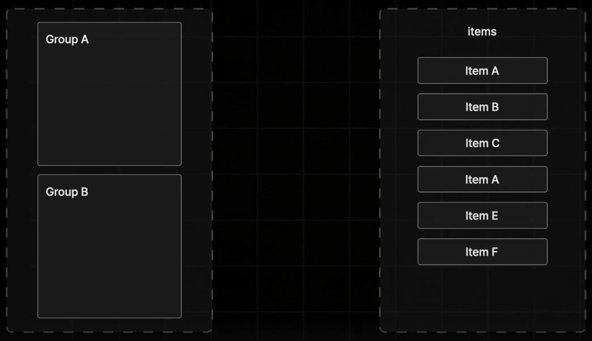
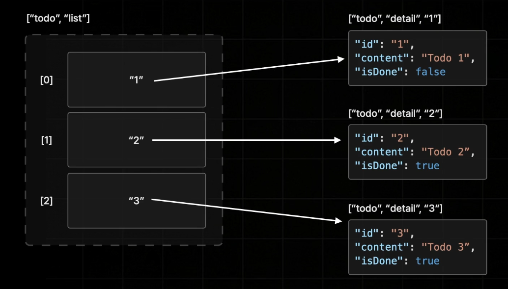

# [_**Root/README.md**_](../../README.md)

# [_**전역 상태 관리와 Zustand**_](ONEBITE-EAXM/docs/zustand/ABOUT.md)

# _**json-server**_
<details>
<summary>접기/펼치기</summary>
<br>

JSON 형태의 파일을 이용하여 간단한 API 서버를 만들어 주는 라이브러리 이다.
### 의존성 설치
```bash
npm install json-server -D
```

### json DB 파일 생성
```json
{
  "todos": [
    {
      "id" : 1,
      "content" : "Todo 1",
      "isDone": true
    },
    {
      "id" : 2,
      "content" : "Todo 2",
      "isDone": true
    },
    {
      "id" : 3,
      "content" : "Todo 3",
      "isDone": false
    }
  ]
}
```

### vite ignored 설정
vite.config.ts 파일에 server 디렉토리 하위에 구성한 파일에 변화가 발생하더라고 React App을 리랜더링 시키는 등의 불필요한 동작을 방지하는 설정을 한다.  
```ts
/* 생략 */
export default defineConfig({
  /* 생략 */
  resolve: {/* 생략 */},
  server: { 
    watch: {
      ignored: ["**/server/**"] // vite가 서버폴더 아래의 파일에 변화가 발생하더라도 React App을 리렌더링 시키는 등의 불필요한 동작을 방지.
    }
  }
});

```

### json-server 기동
아래 명령을 통해 server/db.json 파일 기반으로 json-server를 기동한다.
```bash
npx json-server server/db.json
```

localhost:3000 이라는 주소로 백엔드 서버가 기동되었다.  
앞서 생성한 db.json의 최상위 프로퍼티를 todos로 정의했으며, 해당 프로퍼티 이름은 API의 리소스 경로로 사용된다.
따라서 Todo 데이터는 다음 엔드포인트를 통해 접근할 수 있다.
[http://localhost:3000/todos](http://localhost:3000/todos)

아래 주소처럼 `/todos/1` 과 같이 id 값을 명시해주면 해당하는 id값을 갖는 하나의 아이템만 별도로 조회할 수 있다.  
[http://localhost:3000/todos/1](http://localhost:3000/todos/1)

json-server는 이러한 데이터 조회 기능 말고도 새로운 데이터를 생성하거나 수정하거나 삭제하는 기능까지 모두 제공하기 때문에 일반적인 REST API를 이용하듯 POST 메소드나 UPDATE 메소드 또는 DELETE 메소드로 요청을 보내서 todos 배열의 데이터를 직접 수정할 수도 있다.  

</details>
<br>
<r>
<br>


# _**TanStack Query 01) QueryClient 기본 설정**_
<details>
<summary>접기/펼치기</summary>
<br>

```bash
npm install @tanstack/react-query
```

### QueryClient
TanstackQuery를 이용해 관리하는 모든 서버 상태를 보관하는 일종의 저장소 즉, 스토어이다.  
API 요청의 응답값, 캐싱 값, 캐시 옵션들 등 서버 상태와 관련된 다양한 값들이 보관된다.  
new 키워드를 사용하여 인스턴스를 생성한다.  

### QueryClientProvider
QueryClient를 React App 전역에 공급하는 Provider 컴포넌트이다.
client 속성에 QueryClient 객체를 Prop으로 전달한다.
아래와 같이 React App의 Entry Point인 main.tsx 파일에서 App 컴포넌트를 기준으로 래핑한다.


- main.tsx
  ```tsx
  /* 생략 */

  import { QueryClientProvider, QueryClient } from "@tanstack/react-query";

  const queryClient = new QueryClient();

  createRoot(document.getElementById("root")!).render(
    <QueryClientProvider client={queryClient}>
      <App />
    </QueryClientProvider>
  );
  ```

<br>

</details>
<br>
<br>

# _**Tanstack Query 02) useQuery를 활용한 데이터 조회요청 관리**_
<details>
<summary>접기/펼치기</summary>
<br>


## 서버 데이터 조회
동일한 API 호출 함수를 사용하여 순수 React와 TanStack Query의 서버 데이터 조회 방식을 비교한다.

앞서 [ABOUT.md의 TanStack Query 소개](./ABOUT.md#tanstack-query란)에서 살펴본 것처럼 API 요청에는 응답 데이터뿐만 아니라 `isLoading`, `isError`, `error` 같은 요청 상태도 함께 관리해야 한다.

먼저 순수 React와 TanStack Query에서 공통으로 사용할 API 요청 함수를 작성한다.

### 공통 API 요청 함수

- `api/posts.ts`

```ts
export interface Post {
  id: number;
  title: string;
}

export async function fetchPosts(): Promise<Post[]> {
  const response = await fetch("http://localhost:3000/posts");

  if (!response.ok) {
    throw new Error("Fetch Failed");
  }

  return response.json();
}
```

`fetch` 함수가 직접 반환하는 값은 서버의 응답 정보를 담고 있는 `Response` 객체이다.

```ts
const response = await fetch("http://localhost:3000/posts");
// response: Response
```

`Response` 객체의 `json()`을 호출해야 실제 게시글 데이터를 가져올 수 있다.

```ts
const posts = await response.json();
// posts: Post[]
```

`fetch`는 `isLoading`, `isError`, `error` 같은 요청 상태를 반환하지 않는다.

```text
fetch가 제공하는 값
└── Response 객체

fetch가 제공하지 않는 값
├── isLoading
├── isError
└── error
```

따라서 순수 React에서는 이러한 요청 상태를 직접 만들고 관리해야 한다.

<br>

### 순수 React

- `hooks/use-posts.ts`

```ts
import { useEffect, useState } from "react";
import { fetchPosts, type Post } from "@/api/posts";

export function usePosts() {
  const [data, setData] = useState<Post[]>([]);
  const [isLoading, setIsLoading] = useState(true);
  const [error, setError] = useState<Error | null>(null);

  useEffect(() => {
    fetchPosts()
      .then(setData)
      .catch((error: Error) => setError(error))
      .finally(() => setIsLoading(false));
  }, []);

  return {
    data,
    isLoading,
    isError: error !== null,
    error,
  };
}
```

순수 React에서는 `fetch`가 요청 상태를 제공하지 않으므로 각각의 상태를 직접 관리한다.

```text
data       → useState로 응답 데이터 관리
isLoading  → 요청 시작과 종료 상태 관리
error      → 요청 중 발생한 오류 저장
isError    → error의 존재 여부로 계산
```

<br>

### TanStack Query

TanStack Query의 `useQuery`는 Query Function의 실행 상태를 추적하여 응답 데이터와 요청 상태를 함께 반환한다.

- `hooks/use-posts-query.ts`

```ts
import { useQuery } from "@tanstack/react-query";
import { fetchPosts } from "@/api/posts";

export function usePostsQuery() {
  return useQuery({
    queryKey: ["posts"],
    queryFn: fetchPosts,

    // 최초 요청 실패 후 재시도할 최대 횟수
    retry: 3,
  });
}
```

```tsx
const {
  data: posts,
  isLoading,
  isError,
  error,
} = usePostsQuery();
```

`fetchPosts`가 반환하는 것은 `Post[]` 데이터뿐이다.  
`isLoading`, `isError`, `error`는 `fetchPosts`가 반환하는 값이 아니라 TanStack Query가 요청 과정을 추적하여 만들어 주는 서버 상태이다.

```text
fetchPosts
└── Post[] 반환

useQuery
├── data      → fetchPosts의 반환값
├── isLoading → 초기 데이터 요청 상태
├── isError   → 요청 실패 여부
└── error     → Query Function에서 발생한 오류
```

Query Function에서 발생한 오류는 `useQuery`가 감지하여 `isError`와 `error`에 반영한다.

```ts
if (!response.ok) {
  throw new Error("Fetch Failed");
}
```

`retry: 3`은 최초 요청이 실패한 후 요청을 최대 3번 더 시도한다는 의미이다.

```text
최초 요청 1회
→ 실패 시 재시도 최대 3회
→ 총 요청 횟수 최대 4회
```

<br>

### 컴포넌트 사용

```tsx
const {
  data: posts,
  isLoading,
  isError,
  error,
} = usePostsQuery();

if (isLoading) {
  return <div>로딩 중입니다...</div>;
}

if (isError) {
  return <div>{error.message}</div>;
}

return (
  <ul>
    {posts?.map((post) => (
      <li key={post.id}>{post.title}</li>
    ))}
  </ul>
);
```

두 방식의 차이는 요청 상태를 누가 관리하느냐에 있다.

```text
순수 React
└── 개발자가 data, isLoading, isError, error를 직접 관리

TanStack Query
└── useQuery가 data, isLoading, isError, error를 자동 관리
```

따라서 TanStack Query를 사용하면 [앞서 설명한 서버 상태](./ABOUT.md#서버상태관리란)를 요청마다 직접 구성하지 않고 간편하게 관리할 수 있다.

### Retry 설정

TanStack Query는 Query Function 실행에 실패하면 `retry` 옵션에 따라 요청을 다시 시도할 수 있다.

- `hooks/use-posts-query.ts`

```ts
import { useQuery } from "@tanstack/react-query";
import { fetchPosts } from "@/api/posts";

export function usePostsQuery() {
  return useQuery({
    queryKey: ["posts"],
    queryFn: fetchPosts,

    // 최초 요청 실패 후 재시도할 최대 횟수
    retry: 3,
  });
}
```

`retry`는 최초 요청 횟수가 아니라 최초 요청이 실패한 이후의 재시도 횟수를 의미한다.

```text
최초 요청 1회
→ 실패 시 재시도 최대 3회
→ 총 요청 횟수 최대 4회
```

재시도를 사용하지 않으려면 `0` 또는 `false`를 설정한다.

```ts
useQuery({
  queryKey: ["posts"],
  queryFn: fetchPosts,
  retry: 0,
});
```

조건에 따라 재시도 여부를 직접 결정할 수도 있다.

```ts
useQuery({
  queryKey: ["posts"],
  queryFn: fetchPosts,
  retry: (failureCount, error) => {
    console.log(failureCount, error);

    return failureCount < 3;
  },
});
```

`retry`를 별도로 지정하지 않았을 때 브라우저 환경의 기본 재시도 횟수는 `3`회이다.

지정된 재시도가 모두 실패하면 TanStack Query가 최종 오류 상태로 전환하고 `isError`와 `error`에 해당 요청의 실패 정보를 반영한다.
<br>

</details>
<br>
<br>

# _**Tanstack Query 03) 캐싱 매커니즘**_
<details>
<summary>접기/펼치기</summary>
<br>

## 01) TanstackQuery 캐시 기본개념
<details>
<summary>접기/펼치기</summary>
<br>


Tanstack Query는 useQuery 훅을 통해 백엔드 서버 요청을 보내 데이터를 불러오게 되면, queryKey 속성에 설정해 둔 이름으로 자동으로 캐싱한다.  

```ts
useQuery({
  queryKey: ["posts"], // posts라는 key 값으로 캐싱된다.
  queryFn: fetchPosts,
});
```

이렇게 캐싱된 데이터는 특정 시간 동안 중복된 데이터의 요청이 있을 때 불필요한 요청을 방지하기 위해 대신 사용되어 React App의 성능을 최적화하는데 굉장히 많은 도움을 주게 된다.  

만약 최신 데이터를 꼭 반영해야만 하는 상황이 있다면 유연하게 대처할 수 있도록 자체적인 캐시 매커니즘에 의해서 특정 시간 이후에 데이터가 자동으로 갱신되거나 혹은 캐싱된 key 정보 자체가 삭제되기도 하면서 상황에 따라 최신 데이터를적절히 반영하는 기능까지 함께 제공하고 있다.  

### Tanstack Query 캐시의 5가지 상태

`[ fetching ]` **→** `[ fresh ]` **→** `[ stale ]` **→** `[ inactive ]` **→** `[ deleted ]`

Tanstack Query의 캐시는 위와 같이 총 5가지 단계의 상태를 가지게 된다.  

#### 01) Fetching
아직 데이터가 불러와 지고 있는 중일 때의 상태를 의미한다.  
fetching 상태에서는 특별히 캐시에 저장되는 데이터는 없으며, 데이터의 fetching이 완료되면 다음 단계의 상태인 Fresh로 이동한다.  

#### 02) Fresh
실시간 최신 Fetching된 데이터로, 데이터가 신선한 상태임을 의미한다.  

#### 03) Stale
Fresh 상태의 캐시의 데이터가 시간이 지나 더이상 신선하지 않게 되면 Stale 상태로 변화하게 된다.  
비유하자면, 유통기한이 지나 Fresh한 캐시 데이터가 상해버린 상태라고 이해하면 된다.  

##### Stale Time
위와 같이 Fresh 상태에서 Stale 상태로 변하는데 까지 걸리는 시간을 Stale Time이라고 부른다.  
Stale Time은 기본 0초이며, 각각의 캐시 데이터별로 직접 설정할 수도 있다.  

- refetchOnMount: false
  ```ts
  import { useQuery } from "@tanstack/react-query";
  import { fetchPosts } from "@/api/posts";

  export function usePostsQuery() {
    return useQuery({
      queryKey: ["posts"],
      queryFn: fetchPosts,
      staleTime: 5000
    })
  }
  ```

위와같이 캐시 데이터가 Stale한 상태까지 변하게 되면 Tanstack Query는 더이상 상해버린 데이터를 사용자에게 보여줄 수는 없으므로 특정 타이밍에 해당 데이터를 다시 서버로부터 불러오도록 Re-Fetching 동작을 수행하게 된다.  
불러온 데이터가 오래되면 계속해서 Re-Fetching을 반복해서 다시 불러오게 되는 일종의 순환 구조를 갖게 된다.  

이때 이 Re-Fetching이 발생하는 타이밍으로 아래와 같은 4가지 사점에 수행하게 된다.  
1. **Mount** : 캐시 데이터를 사용하는 컴포넌트가 새롭게 마운트 되었을 때를 의미.
2. **WindowFocus** : 사용자가 브라우저 상에서 현재 React App이 아닌 다른 탭에 접속했다가 돌아왔을 때를 의미.  
3. **Reconnect** : 사용자의 PC 네트워크 연결이 잠깐 끊겼다가 다시 연결이 되었을 때를 의미.  
4. **Interval** : 설정한 특정 시간 주기를 의미.
    - refetchInterval: 1000
      ```ts
      import { useQuery } from "@tanstack/react-query";
      import { fetchPosts } from "@/api/posts";

      export function usePostsQuery() {
        return useQuery({
          queryKey: ["posts"],
          queryFn: fetchPosts,
          refetchInterval: 1000 // 1초
        })
      }
      ```

위와 같은 4가지 시점들은 원할때마다 직접 끄거나 켤수 있다.  
예를들어 만약 데이터가 Stale 상태로 상해 있더라도, WindowFocus와 Reconnect 상황에서는 Re-Fetching되지 않도록 설정할 수 있다.  

정리하자면 Stale 상태의 데이터가 있다면, 기본적으로 위와 같은 4가지 타이밍에 Re-Fetching이 발생하지만, 임의로 키거나 끌 수가 있다.

```ts
import { useQuery } from "@tanstack/react-query";
import { fetchPosts } from "@/api/posts";

export function usePostsQuery() {
  return useQuery({
    queryKey: ["posts"],
    queryFn: fetchPosts,
    refetchOnMount: false,
    refetchOnWindowFocus: false,
    refetchOnReconnect: false,
    refetchInterval: false
  })
}
```

#### 04) Inactive
fresh 혹은 stale 상태로 부터 전환되는 상태이다.  
브라우저 화면상에 캐시 데이터를 사용하는 컴포넌트가 단 하나도 존재하지 않을 때 전환된다.  

##### gcTime
사용하지도 않을 데이터를 오랫동안 캐싱해 둘 필요는 없기 때문에 Inactive 상태의 캐시 데이터는 gcTime(Garbage Collecting Time) 이라는 시간이 지나게 되면 Deleted 상태로 전환이 되면서 메모리에서 삭제가 된다.
  
위와 같이 기본 5분(300초)로 설정된다.  

- gcTime 5초 설정
  ```ts
  import { useQuery } from "@tanstack/react-query";
  import { fetchPosts } from "@/api/posts";

  export function usePostsQuery() {
    return useQuery({
      queryKey: ["posts"],
      queryFn: fetchPosts,
      gcTime: 5000,
    })
  }
  ```

#### 05) deleted
Inactive 상태에서 gcTime이 지나 Query와 캐시 데이터가 메모리에서 제거된 상태이다.  
이후 동일한 queryKey를 사용하는 Query가 다시 실행되면 재사용할 캐시 데이터가 없으므로 최초 요청과 동일하게 데이터를 조회한다.
(Deleted 상태가 되면 Devtools상에서는 목록에서 삭제된다.)

##### staleTime과 gcTime의 독립성
staleTime과 gcTime은 함께 동작하지 않는다.
예를들어 staleTime을 300,000(50분), gtTime을 5,000(5초)로 설정하면, inactive 상태가 된다고 하더라도 stateTime이 굉장히 길기 때문에 데이터는 계속 fresh 상태로 남아 있어 삭제가 안되는것 아닐까 라고 생각할 수 있다.  
staleTime은 엄연히 데이터가 fresh 상태에 있을 때만 동작하는 타이머이기 때문에, 해당 데이터를 조회하는 컴포넌트가 브라우저로 부터 벗어날 경우 무조건 inactive 상태로 변하므로, gcTime 이후 삭제가 된다.  

##### Global Default Options

`useQuery`마다 반복해서 설정하는 Query 옵션은 애플리케이션의 Entry Point에서 생성한 `QueryClient` 인스턴스에 전역 기본 옵션으로 설정할 수 있다.  

`defaultOptions.queries`에 설정한 옵션은 `QueryClientProvider` 하위에서 실행되는 모든 Query의 기본값으로 적용된다.

- `main.tsx`
  ```tsx
  const queryClient = new QueryClient({
    defaultOptions: {
      queries: {
        staleTime: 0,
        gcTime: 5 * 60 * 1000, // 5분
        refetchOnMount: false,
        refetchOnWindowFocus: false,
        refetchOnReconnect: false,
        refetchInterval: false,
      },
    },
  });
  ```

이때, staleTime은 0으로 설정한다.  
개발을 진행할 때 기본적으로 캐시를 최소화해서 동작시키는게 덜 헷갈리고 편하기 때문이다.  
staleTime을 0초로 지정하여 모든 캐시가 서버로부터 불러와 지자마자, 바로 stale 상태로 전환되도록 만들어 사용자가 페이지에 새롭게 방문할 때마다 언제나 다시 Re-Fetching되도록 설정해주는게 다소 일반적이다.  

gcTime을 staleTime보다 길게 설정하는 이유는 메모리에서 실제로 제거해버리는 시간이기 때문에, 특정 캐시 데이터가 fresh한 상태에서 staleTime이 지나 stale 상태로 변화가 되었다고 하더라도 다시 fresh 상태로 전환하는 Re-Fetching 동작을 수행하고 있을 때 화면에 미리 보여주기 위해 캐시 데이터가 메모리에서 바로 삭제돼 버리지 않기 때문에 여유있게 설정을 하는 게 다소 일반적이다.  

개별 `useQuery`에 동일한 옵션을 설정하면 전역 기본 옵션보다 개별 Query의 설정이 우선 적용된다.

```ts
useQuery({
  queryKey: ["posts"],
  queryFn: fetchPosts,

  // 전역 staleTime보다 우선 적용
  staleTime: 60_000,
});
```

```text
QueryClient의 defaultOptions
└── 모든 Query에 적용되는 기본값
    └── 개별 useQuery 옵션이 존재하면 해당 값으로 재정의
```

따라서 애플리케이션에서 공통으로 사용할 캐싱 및 Re-Fetching 정책은 `QueryClient`에 설정하고, 별도의 정책이 필요한 Query만 `useQuery`에서 개별적으로 재정의할 수 있다.


<br>

</details>
<br>
<br>

## 02) Tanstack Query Devtools
<details>
<summary>접기/펼치기</summary>
<br>

- Tanstack Query Devtools 의존성 설치
```bash
npm install @tanstack/react-query-devtools
```

Tanstack Query Devtools의 기능을 하는 ReactQueryDevtools 컴포넌트를 QueryCLientProvider 컴포넌트 내부 최상단에 배치한다.
- main.tsx
```tsx
import { ReactQueryDevtools } from "@tanstack/react-query-devtools";

const queryClient = new QueryClient();

createRoot(document.getElementById("root")!).render(
  <QueryClientProvider client={queryClient}>
    <ReactQueryDevtools />
    <App />
  </QueryClientProvider>
);

```

  
브라우저 우측 하단에 위와 같은 아이콘을 클릭하면 아래와같은 패널이 열리게 된다.  
  
좌측에 숫자 레이블이 붙은 목록에 캐시된 fetching 정보를 볼수있다.  
목록에서 하나의 아이템을 클릭하면 우측에 자세한 정보가 출력된다.  

StaleTime이 끝난 후 Stale 상태로 변해버린 캐시 데이터도 아예 사용되지 않는건 아니다.  
예를들어 캐시 데이터가 Stale 상태가 되어버린 상황에서 뒤로가기를 했다가 다시 페이지에 접속하게되면, 데이터를 최초로 조회하는것과 같이 화면은 로딩 상태로 표시하고 Re-Fetching이 완료되면 해당 데이터로 렌더링 할 것이라 생각할 수 있다.  
```
Stale 캐시 데이터 존재
↓
캐시 데이터로 즉시 렌더링
↓
백그라운드 Re-Fetching
↓
최신 데이터 응답
↓
캐시 갱신
↓
최신 데이터로 리렌더링
```
그러나 Tanstack Query는 그렇게 동작하지 않는다.  
Re-Fetching이 완료되면 새롭게 불러온 최신 데이터를 기존의 데이터와 교체해서 새로운 데이터로 보여주게 된다.  

Stale 상태이더라도 캐시된 데이터로 일단 빠르게 화면을 렌더링 해주고, 최신 데이터를 불러오는 Re-Fetching 상태가 종료되면, 그때 최신 데이터로 교체하는 방식으로 동작된다.  
```
Stale 상태의 캐시 데이터 존재
↓
캐시된 데이터로 즉시 렌더링
↓
백그라운드 Re-Fetching 진행
↓
최신 데이터 응답
↓
캐시 갱신
↓
최신 데이터로 리렌더링
```

</details>
<br>
<br>

<br>
</details>
<br>
<br>


# _**Tanstack Query 04) useMutation을 활용한 데이터 수정 요청 관리**_ 
<details>
<summary>접기/펼치기</summary>
<br>

## useMutation 기본 개념

`useQuery`가 서버 데이터를 조회하고 캐싱하는 작업을 관리한다면, `useMutation`은 서버 데이터를 생성, 수정, 삭제하는 Mutation 요청을 관리하는 Hook이다.  
`useMutation`은 컴포넌트가 마운트되었다고 해서 `mutationFn`을 자동으로 실행하지 않는다. 사용자의 입력이나 버튼 클릭처럼 데이터 변경이 필요한 시점에 `mutate`를 호출하여 요청을 실행한다.

```text
useQuery
└── 컴포넌트 마운트 시 queryFn 자동 실행

useMutation
└── mutate 호출 시 mutationFn 실행
```

<br>

## Todo 생성 API

json-server의 `/todos` 리소스에 `POST` 요청을 보내 새로운 Todo를 생성한다.  
`id`는 json-server가 자동으로 생성하므로 요청 Body에는 사용자가 입력한 `content`와 초기 완료 상태인 `isDone`만 전달한다.

- [create-todo.ts](../../src/api/create-todo.ts)
  ```ts
  import { API_URL } from "@/lib/constants";
  import type { Todo } from "@/types/todo-list";

  export async function createTodo(content: string): Promise<Todo> {
    const response = await fetch(`${API_URL}/todos`, {
      method: "POST",
      body: JSON.stringify({
        content,
        isDone: false,
      }),
    });

    if (!response.ok) {
      throw new Error("Create Todo Failed");
    }

    return response.json();
  }
  ```

서버에 저장된 Todo가 응답으로 반환되며, 이 반환값은 이후 Mutation의 `onSuccess`에서 캐시를 갱신할 때 사용할 수 있다.

<br>

## Todo 생성 Mutation 모듈화

컴포넌트가 API 요청과 캐시 처리 방법을 직접 알지 않도록 `useMutation`을 Custom Hook으로 분리한다.

- [use-create-todo-mutations.ts](../../src/hooks/mutations/use-create-todo-mutations.ts)
  ```ts
  import { createTodo } from "@/api/create-todo";
  import { useMutation } from "@tanstack/react-query";

  export function useCreateTodoMutation() {
    return useMutation({
      mutationFn: createTodo,
    });
  }
  ```

`mutationFn`에는 실제 비동기 요청을 수행하는 함수를 설정한다. `mutate`에 전달한 값은 `mutationFn`의 매개변수로 전달된다.

```text
mutate(content)
↓
createTodo(content)
↓
POST /todos
```

- [todo-editor.tsx](../../src/components/tanstack-query/todo-editor.tsx)
  ```tsx
  export default function TodoEditor() {
    const { mutate, isPending } = useCreateTodoMutation();
    const [content, setContent] = useState("");

    const handleAddClick = () => {
      if (content.trim() === "") return;

      mutate(content);
      setContent("");
    };

    return (
      <div>
        <Input
          value={content}
          onChange={(event) => setContent(event.target.value)}
        />
        <Button disabled={isPending} onClick={handleAddClick}>
          추가
        </Button>
      </div>
    );
  }
  ```

`isPending`은 Mutation 요청이 진행 중인지 나타낸다. 요청 중 버튼을 비활성화하면 동일한 생성 요청이 중복으로 실행되는 것을 방지할 수 있다.

<br>

## Mutation 생명주기 콜백

`useMutation`은 요청 단계에 따라 실행할 수 있는 생명주기 콜백을 제공한다.

| 콜백 | 실행 시점 |
| --- | --- |
| `onMutate` | `mutationFn` 실행 직전 |
| `onSuccess` | Mutation 요청 성공 |
| `onError` | Mutation 요청 실패 |
| `onSettled` | 성공 또는 실패와 관계없이 요청 종료 |

```ts
useMutation({
  mutationFn: createTodo,
  onMutate: (variables) => {},
  onSuccess: (data, variables) => {},
  onError: (error, variables, context) => {},
  onSettled: (data, error, variables, context) => {},
});
```

생성 요청이 실패한 경우 `onError`에서 오류 메시지를 표시할 수 있다.

```ts
onError: (error) => {
  window.alert(error.message);
},
```

<br>

## 생성 후 캐시 데이터 갱신

Mutation 요청은 서버 데이터를 변경하지만 기존 Query Cache를 자동으로 갱신하지 않는다. Todo 생성이 성공해도 `['todo', 'list']` 캐시에 저장된 목록은 이전 데이터이므로, 화면에 새로운 Todo를 반영하려면 관련 캐시를 별도로 갱신해야 한다.

### invalidateQueries를 이용한 캐시 무효화

`useQueryClient`로 `QueryClient`에 접근한 후 `invalidateQueries`를 호출하면 지정한 `queryKey`의 캐시를 Stale 상태로 무효화하고, 현재 사용 중인 Query를 다시 조회한다.

```ts
export function useCreateTodoMutation() {
  const queryClient = useQueryClient();

  return useMutation({
    mutationFn: createTodo,
    onSuccess: () => {
      queryClient.invalidateQueries({
        queryKey: ["todo", "list"],
      });
    },
  });
}
```

```text
Todo 생성 성공
↓
목록 캐시 무효화
↓
GET /todos Re-Fetching
↓
새로운 목록으로 캐시와 화면 갱신
```

이 방식은 구현이 단순하고 서버의 실제 데이터를 다시 받아오기 때문에 데이터 정합성을 확보하기 쉽다. 다만 생성할 때마다 전체 목록을 다시 요청하므로 데이터의 양이 많다면 불필요한 네트워크 비용이 발생할 수 있다.

<br>

### Query Key Factory 패턴

Query Key를 여러 Hook에서 배열 리터럴로 반복해서 작성하면 오타가 발생하거나 Key 구조를 변경하기 어렵다. Query Key Factory 패턴을 적용하여 관련 Key를 계층형 상수로 관리한다.

- [constants.ts](../../src/lib/constants.ts)
  ```ts
  export const QUERY_KEYS = {
    todo: {
      all: ["todo"],
      list: ["todo", "list"],
      detail: (id: string) => ["todo", "detail", id],
    },
  };
  ```

```text
["todo"]
├── ["todo", "list"]
└── ["todo", "detail", id]
```

공통 상수를 조회와 Mutation에 함께 사용하면 캐시를 저장할 때와 갱신할 때 동일한 Key를 사용할 수 있다.

```ts
queryClient.invalidateQueries({
  queryKey: QUERY_KEYS.todo.list,
});
```

상위 Key인 `QUERY_KEYS.todo.all`을 사용하면 Todo와 관련된 하위 Query들을 함께 대상으로 지정할 수 있고, `list` 또는 `detail(id)`을 사용하면 필요한 범위만 구체적으로 선택할 수 있다.

<br>

### setQueryData를 이용한 캐시 직접 갱신

생성 API가 저장된 Todo를 응답으로 반환한다면 목록 전체를 Re-Fetching하지 않고 `setQueryData`로 기존 캐시에 새로운 Todo를 추가할 수 있다.

- [use-create-todo-mutations.ts](../../src/hooks/mutations/use-create-todo-mutations.ts)
  ```ts
  export function useCreateTodoMutation() {
    const queryClient = useQueryClient();

    return useMutation({
      mutationFn: createTodo,
      onSuccess: (newTodo: Todo) => {
        queryClient.setQueryData<Todo[]>(
          QUERY_KEYS.todo.list,
          (previousTodos) => {
            if (!previousTodos) return [newTodo];
            return [...previousTodos, newTodo];
          },
        );
      },
      onError: (error) => {
        window.alert(error.message);
      },
    });
  }
  ```

```text
Todo 생성 성공
↓
서버가 생성된 Todo 반환
↓
기존 목록 캐시에 새로운 Todo 추가
↓
추가 조회 없이 화면 갱신
```

`invalidateQueries`와 `setQueryData`의 차이는 다음과 같다.

| 방식 | 장점 | 주의점 |
| --- | --- | --- |
| `invalidateQueries` | 서버 데이터를 다시 조회하므로 정합성 확보가 쉬움 | 추가 네트워크 요청 발생 |
| `setQueryData` | 추가 요청 없이 즉시 캐시 갱신 | 클라이언트가 서버 변경 결과를 정확히 반영해야 함 |

<br>

## Todo 수정 API

Todo의 완료 여부처럼 일부 프로퍼티만 수정하기 위해 json-server의 `/todos/:id` 리소스에 `PATCH` 요청을 보낸다.

- [update-todo.ts](../../src/api/update-todo.ts)
  ```ts
  import { API_URL } from "@/lib/constants";
  import type { Todo } from "@/types/todo-list";

  type UpdateTodo = Partial<Todo> & { id: string };

  export async function updateTodo(todo: UpdateTodo): Promise<Todo> {
    const response = await fetch(`${API_URL}/todos/${todo.id}`, {
      method: "PATCH",
      body: JSON.stringify(todo),
    });

    if (!response.ok) {
      throw new Error("Update Todo Failed");
    }

    return response.json();
  }
  ```

`Partial<Todo>`는 `Todo`의 모든 프로퍼티를 선택적 프로퍼티로 변경한다. 하지만 수정 대상을 식별할 `id`는 반드시 필요하므로 Intersection 타입을 이용하여 `id`만 필수 프로퍼티로 재정의한다.

```ts
Partial<Todo> & { id: string }
```

```ts
updateTodo({ id: "1", isDone: true }); // 가능
updateTodo({ id: "1", content: "수정된 내용" }); // 가능
// updateTodo({ content: "수정된 내용" }); // id가 없으므로 타입 오류
```

json-server에서 생성된 `id`가 문자열로 반환되는 동작에 맞추어 Todo의 `id` 타입도 `string`으로 사용한다.

<br>

## onMutate를 이용한 낙관적 업데이트

일반적인 Mutation은 서버 응답이 완료된 이후 화면을 갱신한다. 서버 응답이 느리면 사용자가 체크박스를 클릭한 뒤 결과가 반영될 때까지 기다려야 한다.

낙관적 업데이트는 서버 요청이 성공할 것이라고 가정하고 `onMutate` 시점에 캐시를 먼저 변경하여 화면에 즉시 결과를 표시하는 방식이다.

```text
사용자 체크박스 클릭
↓
onMutate에서 캐시 즉시 변경
↓
변경된 캐시로 화면 렌더링
↓
백그라운드에서 PATCH 요청 진행
```

- [todo-item.tsx](../../src/pages/tanstack-query/todo-item.tsx)
  ```tsx
  export default function TodoItem({ id, content, isDone }: Todo) {
    const { mutate } = useUpdateTodoMutation();

    const handleCheckboxClick = () => {
      mutate({
        id,
        isDone: !isDone,
      });
    };

    return (
      <input
        type="checkbox"
        checked={isDone}
        onClick={handleCheckboxClick}
      />
    );
  }
  ```

- [use-update-todo.mutation.ts](../../src/hooks/mutations/use-update-todo.mutation.ts)
  ```ts
  export default function useUpdateTodoMutation() {
    const queryClient = useQueryClient();

    return useMutation({
      mutationFn: updateTodo,
      onMutate: async (updatedTodo) => {
        const previousTodos = queryClient.getQueryData<Todo[]>(
          QUERY_KEYS.todo.list,
        );

        queryClient.setQueryData<Todo[]>(
          QUERY_KEYS.todo.list,
          (todos) => {
            if (!todos) return [];

            return todos.map((todo) =>
              todo.id === updatedTodo.id
                ? { ...todo, ...updatedTodo }
                : todo,
            );
          },
        );

        return { previousTodos };
      },
    });
  }
  ```

`updatedTodo`에는 `mutate`로 전달한 수정 정보가 들어온다. 기존 배열을 `map`으로 순회하면서 `id`가 같은 Todo에 수정 정보를 병합하고, 나머지 Todo는 기존 객체를 그대로 유지한다.

```ts
{ ...todo, ...updatedTodo }
```

낙관적 업데이트는 빠른 사용자 경험을 제공하지만, 아직 서버 요청이 확정되지 않은 상태에서 클라이언트 캐시를 먼저 변경하므로 예외 상황을 함께 처리해야 한다.

<br>

## 낙관적 업데이트 예외 처리

### 01) 서버 요청 실패 시 캐시 롤백

`onMutate`로 캐시를 먼저 변경한 뒤 서버 요청이 실패하면 화면에는 서버에 저장되지 않은 데이터가 남게 된다. 이를 방지하기 위해 낙관적 업데이트 전에 기존 캐시를 스냅샷으로 저장하고, `onError`에서 원래 데이터로 복원한다.

```text
기존 캐시 스냅샷 저장
↓
낙관적 업데이트
↓
서버 요청 실패
↓
onError에서 기존 캐시로 롤백
```

`onMutate`에서 반환한 값은 `onError`의 세 번째 매개변수로 전달된다.

```ts
onMutate: async (updatedTodo) => {
  const previousTodos = queryClient.getQueryData<Todo[]>(
    QUERY_KEYS.todo.list,
  );

  // 낙관적 캐시 업데이트 생략

  return { previousTodos };
},

onError: (_error, _variables, context) => {
  if (context?.previousTodos) {
    queryClient.setQueryData(
      QUERY_KEYS.todo.list,
      context.previousTodos,
    );
  }
},
```

```text
onError 첫 번째 인수  → 발생한 오류 객체
onError 두 번째 인수  → mutate에 전달한 variables
onError 세 번째 인수  → onMutate의 반환값
```

<br>

### 02) 진행 중인 조회 요청 취소

목록 조회 요청이 진행 중일 때 낙관적으로 캐시를 변경하면, 나중에 완료된 조회 응답이 수정된 캐시를 이전 서버 데이터로 덮어쓸 수 있다.

```text
GET /todos 요청 진행
↓
onMutate에서 캐시 수정
↓
기존 GET /todos 요청 완료
↓
조회 결과가 낙관적 캐시를 덮어씀
```

따라서 캐시를 수정하기 전에 `cancelQueries`로 동일한 Query Key를 사용하는 진행 중인 조회 요청을 취소한다.

```ts
onMutate: async (updatedTodo) => {
  await queryClient.cancelQueries({
    queryKey: QUERY_KEYS.todo.list,
  });

  const previousTodos = queryClient.getQueryData<Todo[]>(
    QUERY_KEYS.todo.list,
  );

  // 낙관적 캐시 업데이트 생략

  return { previousTodos };
},
```

`await`를 사용하여 진행 중인 조회 요청의 취소가 완료된 이후 기존 캐시를 백업하고 낙관적 업데이트를 수행한다.

<br>

### 03) 서버 데이터와 최종 동기화

서버가 요청값을 그대로 저장하지 않고 별도의 값으로 가공하거나 다른 사용자가 같은 데이터를 수정하면, Mutation 요청이 성공해도 낙관적으로 만든 캐시와 실제 서버 데이터가 다를 수 있다.

`onSettled`는 요청의 성공과 실패 여부에 관계없이 마지막에 실행된다. 관련 Query를 무효화하여 서버의 실제 데이터를 다시 조회하면 캐시와 서버 상태를 최종적으로 동기화할 수 있다.

```ts
onSettled: () => {
  return queryClient.invalidateQueries({
    queryKey: QUERY_KEYS.todo.list,
  });
},
```

```text
낙관적 업데이트
↓
Mutation 요청 성공 또는 실패
↓
onSettled 실행
↓
목록 캐시 무효화
↓
서버 데이터 Re-Fetching
↓
실제 서버 데이터로 캐시 동기화
```

<br>

## 낙관적 업데이트 전체 흐름

- [use-update-todo.mutation.ts](../../src/hooks/mutations/use-update-todo.mutation.ts)
  ```ts
  export default function useUpdateTodoMutation() {
    const queryClient = useQueryClient();

    return useMutation({
      mutationFn: updateTodo,

      onMutate: async (updatedTodo) => {
        await queryClient.cancelQueries({
          queryKey: QUERY_KEYS.todo.list,
        });

        const previousTodos = queryClient.getQueryData<Todo[]>(
          QUERY_KEYS.todo.list,
        );

        queryClient.setQueryData<Todo[]>(
          QUERY_KEYS.todo.list,
          (todos) => {
            if (!todos) return [];

            return todos.map((todo) =>
              todo.id === updatedTodo.id
                ? { ...todo, ...updatedTodo }
                : todo,
            );
          },
        );

        return { previousTodos };
      },

      onError: (_error, _variables, context) => {
        if (context?.previousTodos) {
          queryClient.setQueryData(
            QUERY_KEYS.todo.list,
            context.previousTodos,
          );
        }
      },

      onSettled: () => {
        return queryClient.invalidateQueries({
          queryKey: QUERY_KEYS.todo.list,
        });
      },
    });
  }
  ```

```text
mutate(updatedTodo)
↓
onMutate
├── 진행 중인 목록 조회 취소
├── 기존 캐시 스냅샷 저장
└── 낙관적으로 캐시 수정
↓
mutationFn: updateTodo
├── 성공
└── 실패 → onError에서 기존 캐시로 롤백
↓
onSettled
└── 캐시 무효화 및 Re-Fetching으로 서버와 최종 동기화
```


<br>
</details>
<br>
<br>

# _**Tanstack Query 05) Query Cache 정규화**_
<details>
<summary>접기/펼치기</summary>
<br>

## 정규화란?

정규화(Normalization)는 중복되는 데이터를 하나의 원본으로 분리하고, 다른 데이터에서는 해당 원본을 식별할 수 있는 값만 참조하도록 구성하는 방식이다.  

  

위와 같이 복잡한 구조로 중첩 되어 있는 데이터를  

아래와 같이 평탄화 함으로써 각각의 개별 아이템에 더 쉽게 접근할 수있다.  

  

또한 평탄화된 개별 아이템들 중 중복된 데이터가 존재한다면, 해당 데이터를 제거까지 해 줌으로써 데이터를 보다 효율적으로 저장할 수 있도록 하는것 까지 정규화에 해당한다.  


일반적인 Todo 목록을 그대로 캐싱하면 목록 Query와 상세 Query에 동일한 Todo 객체가 중복으로 저장될 수 있다.

```text
["todo", "list"]
└── [
      { id: "1", content: "Todo 1", isDone: false },
      { id: "2", content: "Todo 2", isDone: true }
    ]

["todo", "detail", "1"]
└── { id: "1", content: "Todo 1", isDone: false }
```

이 구조에서는 `id: "1"`인 Todo가 목록 캐시와 상세 캐시에 각각 존재한다. Todo를 수정할 때 한쪽 캐시만 갱신하면 동일한 데이터를 나타내는 두 캐시의 값이 서로 달라질 수 있다.

```text
목록 캐시의 Todo 1  → isDone: false
상세 캐시의 Todo 1  → isDone: true
                         ↑ 캐시 불일치
```

캐시를 정규화하면 Todo 객체는 각 상세 Query에 한 번씩 저장하고, 목록 Query에는 Todo의 `id`만 저장한다.

  

```text
["todo", "list"]
└── ["1", "2"]

["todo", "detail", "1"]
└── { id: "1", content: "Todo 1", isDone: false }

["todo", "detail", "2"]
└── { id: "2", content: "Todo 2", isDone: true }
```

```text
목록 캐시
└── Todo의 순서와 포함 여부를 나타내는 id[]

상세 캐시
└── 각 Todo의 실제 데이터
```

TanStack Query는 서버 응답을 자동으로 정규화하지 않는다. 따라서 Query Function과 `QueryClient`를 이용하여 필요한 캐시 구조를 직접 구성해야 한다.

<br>

## 목록 조회 결과 정규화

`fetchTodos`는 서버에서 `Todo[]`를 반환한다. 목록 Query의 `queryFn`에서 각 Todo를 상세 Query Cache에 저장하고, 목록 Query에는 Todo의 `id[]`만 반환한다.

- [use-todos.data.ts](../../src/hooks/normalization/quries/use-todos.data.ts)
  ```ts
  import { fetchTodos } from "@/api/fetch-todos";
  import { QUERY_KEYS } from "@/lib/constants";
  import type { Todo } from "@/types/todo-list";
  import { useQuery, useQueryClient } from "@tanstack/react-query";

  export function useTodosData() {
    const queryClient = useQueryClient();

    return useQuery({
      queryKey: QUERY_KEYS.todo.list,
      queryFn: async () => {
        const todos = await fetchTodos();

        todos.forEach((todo) => {
          queryClient.setQueryData<Todo>(
            QUERY_KEYS.todo.detail(todo.id),
            todo,
          );
        });

        return todos.map((todo) => todo.id);
      },
    });
  }
  ```

실행 과정은 다음과 같다.

```text
GET /todos
↓
Todo[] 응답
↓
각 Todo를 ["todo", "detail", id] 캐시에 저장
↓
Todo[]를 id[]로 변환
↓
id[]를 ["todo", "list"] 캐시에 저장
```

```ts
// 서버 응답
[
  { id: "1", content: "Todo 1", isDone: false },
  { id: "2", content: "Todo 2", isDone: true },
]

// 목록 Query의 최종 반환값
["1", "2"]
```

<br>

## 정규화된 목록 렌더링

목록 페이지는 더 이상 `Todo[]`를 직접 순회하지 않는다. `useTodosData`가 반환한 `id[]`를 순회하며 각 `TodoItem`에 `id`만 전달한다.

- [todo-list-page.tsx](../../src/pages/tanstack-query/normalization/todo-list-page.tsx)
  ```tsx
  export default function TodoListPage() {
    const {
      data: todoIds,
      isLoading,
      error,
    } = useTodosData();

    if (error) return <div>오류가 발생했습니다.</div>;
    if (isLoading) return <div>로딩 중입니다...</div>;

    return (
      <div>
        <TodoEditor />

        {todoIds?.map((id) => (
          <TodoItem key={id} id={id} />
        ))}
      </div>
    );
  }
  ```

각 `TodoItem`은 전달받은 `id`를 이용하여 자신의 상세 Query Cache를 구독한다.

- [todo-item.tsx](../../src/pages/tanstack-query/normalization/todo-item.tsx)
  ```tsx
  export default function TodoItem({ id }: { id: string }) {
    const { data: todo } = useTodoDataById(id, "LIST");

    if (!todo) {
      throw new Error("Todo Data Undefined");
    }

    const { content, isDone } = todo;

    return (
      <div>
        <input type="checkbox" checked={isDone} />
        <span>{content}</span>
      </div>
    );
  }
  ```

```text
TodoListPage
├── ["todo", "list"] → ["1", "2"] 구독
│
├── TodoItem id="1"
│   └── ["todo", "detail", "1"] 구독
│
└── TodoItem id="2"
    └── ["todo", "detail", "2"] 구독
```

특정 Todo의 상세 캐시만 변경하면 해당 캐시를 구독하는 `TodoItem`만 변경된 데이터를 전달받는다. 목록의 `id[]`와 다른 Todo의 상세 캐시는 변경되지 않는다.

<br>

## 목록과 상세 페이지의 Query 재사용

목록을 조회할 때 각 Todo의 상세 캐시를 이미 생성했으므로 목록의 `TodoItem`에서는 동일한 데이터를 다시 서버에 요청할 필요가 없다. 반면 상세 페이지에 URL로 직접 접속하면 해당 Todo의 캐시가 없을 수 있으므로 서버 조회가 필요하다.

조회 목적을 `LIST`와 `DETAIL`로 구분하여 `enabled` 옵션을 설정할 수 있다.

- [use-todo-data-by-ids.ts](../../src/hooks/normalization/quries/use-todo-data-by-ids.ts)
  ```ts
  type QueryType = "LIST" | "DETAIL";

  export function useTodoDataById(
    id: string,
    type: QueryType,
  ) {
    return useQuery({
      queryKey: QUERY_KEYS.todo.detail(id),
      queryFn: () => fetchTodoById(id),
      enabled: type === "DETAIL",
    });
  }
  ```

```text
LIST에서 호출
├── enabled: false
├── 상세 캐시에 저장된 Todo 사용
└── 별도 상세 API 요청 생략

DETAIL에서 호출
├── enabled: true
├── 상세 캐시가 없으면 GET /todos/:id 요청
└── 조회 결과를 동일한 상세 Query Key에 저장
```

`enabled: false`는 Query Cache 조회까지 막는 옵션이 아니다. 자동 요청만 비활성화하므로 동일한 `queryKey`에 캐시 데이터가 존재하면 해당 데이터를 반환할 수 있다.

<br>

## 정규화된 캐시의 생성 처리

Todo 생성 요청이 성공하면 서버가 반환한 `newTodo`를 상세 캐시에 저장하고, 목록 캐시에는 새로운 Todo의 `id`만 추가한다.

- [use-create-todo-mutations.ts](../../src/hooks/normalization/mutations/use-create-todo-mutations.ts)
  ```ts
  export function useCreateTodoMutation() {
    const queryClient = useQueryClient();

    return useMutation({
      mutationFn: createTodo,
      onSuccess: (newTodo: Todo) => {
        queryClient.setQueryData<Todo>(
          QUERY_KEYS.todo.detail(newTodo.id),
          newTodo,
        );

        queryClient.setQueryData<string[]>(
          QUERY_KEYS.todo.list,
          (todoIds) => {
            if (!todoIds) return [newTodo.id];
            return [...todoIds, newTodo.id];
          },
        );
      },
    });
  }
  ```

```text
POST /todos 성공
↓
서버가 newTodo 반환
↓
detail(newTodo.id) 캐시에 newTodo 저장
↓
list 캐시에 newTodo.id 추가
↓
새로운 TodoItem 렌더링
```

<br>

## 정규화된 캐시의 수정 처리

Todo의 실제 데이터는 상세 캐시에 저장되어 있으므로 수정할 때 목록 배열 전체를 순회할 필요가 없다. 수정할 Todo의 `detail(id)` 캐시만 찾아서 갱신한다.

- [use-update-todo-mutation.ts](../../src/hooks/normalization/mutations/use-update-todo-mutation.ts)
  ```ts
  export function useUpdateTodoMutation() {
    const queryClient = useQueryClient();

    return useMutation({
      mutationFn: updateTodo,

      onMutate: async (updatedTodo) => {
        const queryKey = QUERY_KEYS.todo.detail(updatedTodo.id);

        await queryClient.cancelQueries({ queryKey });

        const previousTodo = queryClient.getQueryData<Todo>(
          queryKey,
        );

        queryClient.setQueryData<Todo>(queryKey, (todo) => {
          if (!todo) return;
          return { ...todo, ...updatedTodo };
        });

        return { previousTodo };
      },

      onError: (_error, _variables, context) => {
        if (context?.previousTodo) {
          queryClient.setQueryData(
            QUERY_KEYS.todo.detail(context.previousTodo.id),
            context.previousTodo,
          );
        }
      },
    });
  }
  ```

수정 과정에서도 낙관적 업데이트의 예외 처리를 동일하게 적용한다.

```text
수정 대상 detail(id) Query 취소
↓
기존 Todo 스냅샷 저장
↓
detail(id) 캐시 낙관적 업데이트
↓
PATCH 요청 실패 시 기존 Todo로 롤백
```

정규화 이전에는 목록 캐시에서 수정 대상을 찾기 위해 모든 Todo를 `map`으로 순회했다.

```ts
previousTodos.map((todo) =>
  todo.id === updatedTodo.id
    ? { ...todo, ...updatedTodo }
    : todo,
);
```

정규화 이후에는 수정할 Todo의 Query Key를 알고 있으므로 해당 상세 캐시 하나만 직접 갱신할 수 있다.

```ts
queryClient.setQueryData(
  QUERY_KEYS.todo.detail(updatedTodo.id),
  // ...
);
```

<br>

## 정규화된 캐시의 삭제 처리

Todo 삭제 요청이 성공하면 해당 Todo의 상세 Query를 캐시에서 제거하고, 목록 캐시의 `id[]`에서도 삭제한 Todo의 `id`를 제거한다.

- [use-delete-todo-mutation.ts](../../src/hooks/normalization/mutations/use-delete-todo-mutation.ts)
  ```ts
  export function useDeleteTodoMutation() {
    const queryClient = useQueryClient();

    return useMutation({
      mutationFn: deleteTodo,
      onSuccess: (deletedTodo) => {
        queryClient.removeQueries({
          queryKey: QUERY_KEYS.todo.detail(deletedTodo.id),
        });

        queryClient.setQueryData<string[]>(
          QUERY_KEYS.todo.list,
          (todoIds) => {
            if (!todoIds) return [];

            return todoIds.filter(
              (id) => id !== deletedTodo.id,
            );
          },
        );
      },
    });
  }
  ```

```text
DELETE /todos/:id 성공
↓
detail(id) Query Cache 제거
↓
list 캐시에서 id 제거
↓
목록에서 해당 TodoItem 제거
```

상세 캐시만 제거하면 목록에는 삭제된 Todo의 `id`가 남고, 목록의 `id`만 제거하면 사용되지 않는 상세 캐시가 남는다. 따라서 정규화된 캐시의 관계를 고려하여 양쪽을 함께 갱신해야 한다.

<br>

## 정규화 전후 비교

| 구분 | 비정규화 캐시 | 정규화 캐시 |
| --- | --- | --- |
| 목록 데이터 | `Todo[]` | `string[]` |
| 상세 데이터 | 별도의 `Todo` | 하나의 `Todo` 원본 |
| 데이터 중복 | 목록과 상세에 중복 저장 | 상세 Query에 한 번 저장 |
| 목록 렌더링 | Todo 객체를 Item에 전달 | id를 전달하고 상세 캐시 구독 |
| 개별 수정 | 목록 배열을 순회하여 교체 | `detail(id)` 캐시 직접 수정 |
| 생성 | 목록에 Todo 객체 추가 | 상세 캐시 생성 후 목록에 id 추가 |
| 삭제 | 목록에서 Todo 객체 제거 | 상세 캐시 제거 후 목록에서 id 제거 |

```text
비정규화
TodoListPage
└── Todo[]
    └── TodoItem에 Todo 객체 전달

정규화
TodoListPage
└── id[]
    └── TodoItem이 detail(id) 캐시 구독
```

<br>

## 정규화 적용 시 주의점

정규화는 데이터 중복과 개별 캐시 갱신 범위를 줄여주지만 캐시 간의 관계를 직접 관리해야 하므로 구현 복잡도가 증가한다.

1. 목록 조회 시 각 상세 Query Cache를 함께 생성해야 한다.
2. 생성 시 상세 캐시와 목록의 `id[]`를 모두 갱신해야 한다.
3. 삭제 시 상세 캐시와 목록의 `id[]`를 모두 제거해야 한다.
4. 목록과 상세 Query는 서로 다른 `staleTime`과 `gcTime`을 가질 수 있다.
5. 목록 캐시는 남아 있지만 필요한 상세 캐시가 먼저 제거되는 상황을 고려해야 한다.
6. 서버 데이터와의 최종 정합성이 중요하다면 관련 Query를 무효화하여 다시 검증해야 한다.

단순한 데이터 구조에서는 비정규화된 캐시가 더 이해하기 쉽고 관리 비용도 적다. 동일한 객체가 여러 Query에 중복되고 개별 데이터 수정이 빈번하여 캐시 동기화가 복잡해질 때 정규화를 적용하는 것이 효과적이다.

<br>
</details>
<br>
<br>

# Template
<details>
<summary>접기/펼치기</summary>
<br>

<br>
</details>
<br>
<br>
