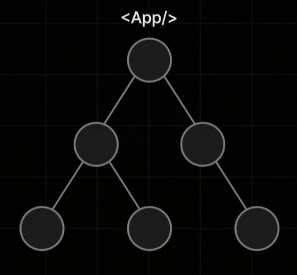
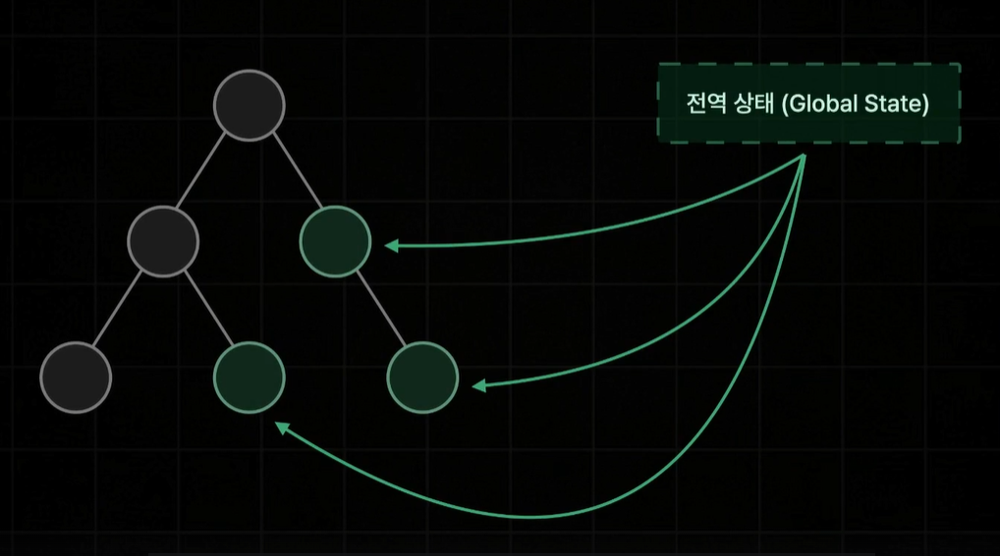
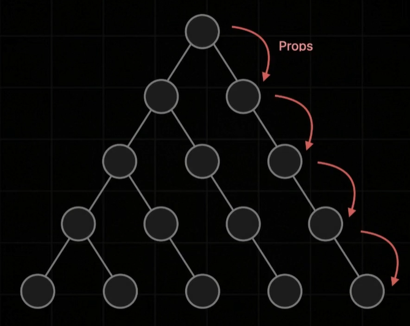
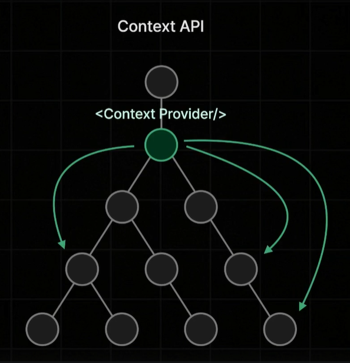
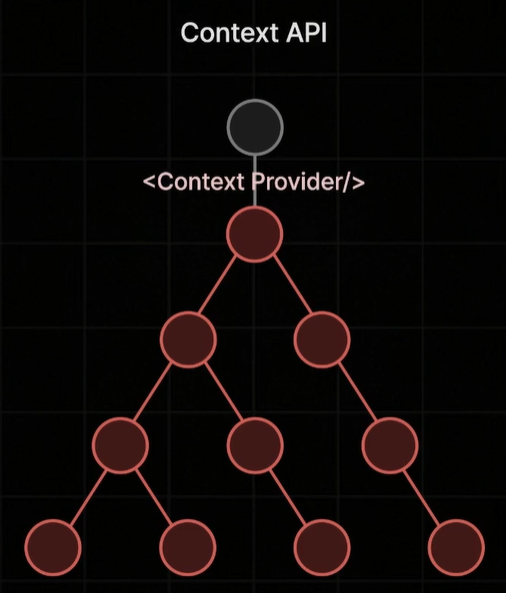
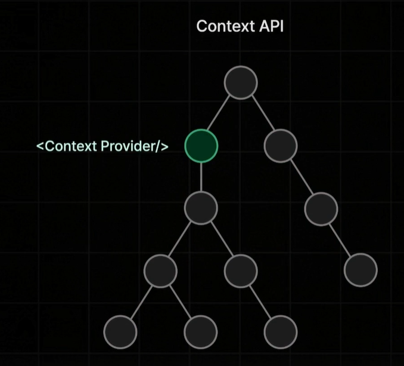
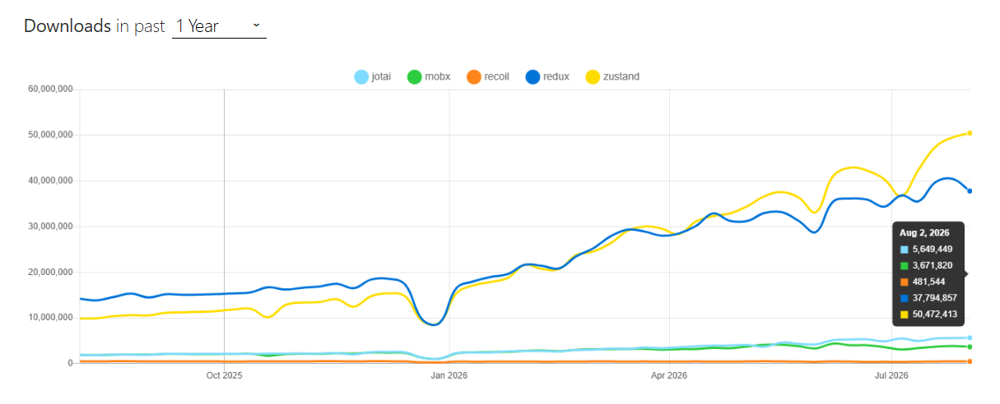
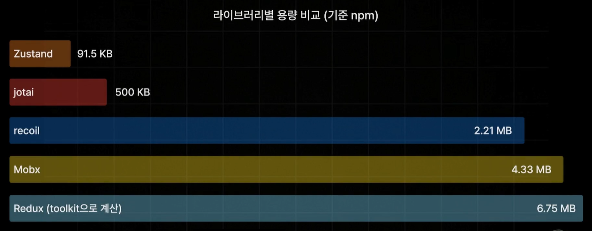

# [_**Root/README.md**_](../../README.md)

# _**전역 상태 관리와 Zustand**_
<details>
<summary>접기/펼치기</summary>
<br>

## 전역상태관리란?
  

복잡한 계층 구조를 갖는 리액트 앱이 있을때  

  

해당 앱의 모든 컴포넌트에서 접근 가능한 전역 상태.  
글로벌한 state값을 새롭게 생성하고 수정할 수 있도록 관리하는 것을 말한다.  

사용자의 현재 인증 정보 혹은 다크모드릉 위한 테마 정보, 쇼핑몰 서비스를 만든다면 장바구니에 담긴 정보처럼 리액트 앱의 모든 컴포넌트에서 접근할 수 있어야 되는 데이터들을 전역상태로 만들어 관리하는 행위 자체를 전역 상태 관리라고 표현한다.  

전역 상태 관리는 어느정도 규모가 있는 서비스를 만들기 위해서는 거의 반드시 필요하다.  

  

전역 상태 관리 없는 리액트에서는 props만을 이용해 오직 한단계 아래 자식 컴포넌트에게만  데이터를 전달할 수 있기 때문에  
위 사진과 같이 컴포넌트 계층 구조가 복잡해지면 복잡해질수록 전달돼야 하는 props가 계속해서 깊어지고 계속해서 중첩되어 데이터 공유가 굉장히 복잡해지고 불편해지는 이슈가 발생하며, 이를 props driling이라고 부른다.  
이런 props driling은 데이터의 공유 자체가 불편해진다는 문제뿐만 아니라 하나의 데이터가 업데이트 되었을 때 해당 데이터를 props로 전달받는 모든 컴포넌트들이 동시에 렌더링이 되어 버린다는 성능상의 이슈도 유발할 수 있기 때문에 꽤나 큰 문제점으로 다뤄진다.  

이러한 문제를 해결하기 위해 리액트의 내장 기능인 Context API를 비롯해서 Redux, Jotai, Recoil, Mobx Zustand 같은 전역 상태 관리 전용 라이브러리들 까지 제공되고 있다.  
Context API 같은 경우에는 정확히 전역 상태 관리를 위한 기능이라기 보다는 Props Drilling이라는 이슈를 해결하기 위해서 제공되는 기능이다.  



위와 같이 전역 상태 관리를 하는 Context를 추가하게 되면, Context Provider가 공급하는 데이터를 컴포넌트 어디서든 전역으로 가져다 쓸수 있다.  
문제는 Context의 상태값이 한 번 업데이트 될 때마다 컨텍스트 하위의 모든 컴포넌트들이 불필요하게 다 리렌더링 될 수 있다는 치명적인 한계점이 존재한다.  

  

때문에, Context API는 완전히 전역적인 데이터를 관리하기 보다는 특정 컴포넌트 끼리만 공유하는 데이터를 다룰 때 더 효과적으로 사용할 수 있다.  

  

정리하자면, Context API는 보통 범용적인 전역 상태관리 보다는 국소적인 특정 컴포넌트들 사이에서만 공유되는 데이터 공유를 위해 더 자주 사용된다.  
따라서, 완전한 전역 상태 관리를 위해서는 Context API 보다는 Redux, Zustand, Mobx, Jotai Recoil 같은 전역 상태 관리를 위해 전용으로 만들어진 라이브러리들을 사용하는 것이 더 일반적이고 훨씬 더 좋은 접근이다.  

## Zustand란?
전역 상태를 관리해주는 라이브러리로, 많은 사람들이 사용하고 있으며, 용량이 매우 가볍고 굉장히 직관적이기 때문에 배우기가 쉽다.  
25년 08월 02일 기준 npm trends 사이트에서 가장 대표적으로 쓰이고 있는 5가지 전역상태관리 라이브러리들의 1년간 다운로드량을 비교해보면 전통 강자인 Redux를 뛰어 넘은것을 볼 수 있다.  

  

라이브러리별 용량 또한 Recoil이나 Mobx, Redux처럼 MB단위로 넘어가는 다른 라이브러리들에 비해 91.5KB라는 굉장히 작은 용량으로 제공되는 것을 볼 수 있다.  

  

이에 더해 화룡 정점으로 별도의 어떠한 설정 없이 create라는 함수를 호출하여 count state를 생성하고 state를 증감할 수 있는 상태변화 함수까지 한번에 생성하는 식으로 간단하게 전역상태를 관리할 수 있는 굉장히 단순하고 쉬운 사용방법을 제공하고 있다.  
```js
import { create } from "zustand"
const useCountStore = create((set, get) => ({
  count: 0,
  increase: () => set((state) => state + 1),
  decrease: () => set((state) => state - 1)
}))
```
</details>
<br>


# _**Zustand 기본 사용법**_
<details>
<summary>접기/펼치기</summary>
<br>

## 의존성 설치
```bash
npm install zustand
```
<br>

## Store 기본 구성과 Action 업데이트

Zustand의 `create` 함수에 Store 타입과 생성 함수를 전달하여 전역 Store Hook을 만든다.  
생성 함수가 반환하는 객체에는 상태(state)와 상태를 변경하는 액션(action)을 함께 정의할 수 있다.

### get/set 함수 활용 업데이트

Store 생성 함수가 제공하는 `get()`으로 현재 Store를 조회하고, `set()`에 변경할 상태를 객체로 전달한다.  
`set()`은 Store 전체를 초기화하는 것이 아니라 명시한 프로퍼티만 병합하여 업데이트한다.

- [count.ts](../../src/store/count/count.ts)
  ```ts
  import { create } from "zustand";

  type Store = {
    count: number;
    increase: () => void;
    decrease: () => void;
  };

  export const useCountStore = create<Store>((set, get) => ({
    count: 0,
    increase: () => {
      const count = get().count;
      set({ count: count + 1 });
    },
    decrease: () => {
      const count = get().count;
      set({ count: count - 1 });
    },
  }));
  ```

### set 함수형 업데이트

이전 상태를 기준으로 값을 계산할 때는 `set((store) => newState)` 형태의 함수형 업데이트를 사용할 수 있다.  
콜백의 매개변수로 현재 Store가 제공되므로 별도로 `get()`을 호출하지 않아도 된다.

- [count.ts](../../src/store/count/count.ts)
  ```ts
  import { create } from "zustand";

  type Store = {
    count: number;
    increase: () => void;
    decrease: () => void;
  };

  export const useCountStore = create<Store>((set) => ({
    count: 0,
    increase: () => {
      set((store) => ({
        count: store.count + 1,
      }));
    },
    decrease: () => {
      set((store) => ({
        count: store.count - 1,
      }));
    },
  }));
  ```

<br>

## Counter 컴포넌트 역할 분리

카운터 페이지가 Store 조회, 출력, 조작을 모두 담당하지 않도록 역할별 컴포넌트로 분리한다.

```text
CounterPage
├── Viewer     → count 출력
└── Controller → increase/decrease 실행
```

- [counter-page.tsx](../../src/pages/counter-page.tsx)
  ```tsx
  import Controller from "@/components/zustand/counter/controller";
  import Viewer from "@/components/zustand/counter/viewer";

  export default function CounterPage() {
    return (
      <div>
        <h1 className="text-2xl font-bold">Counter</h1>
        <Viewer />
        <Controller />
      </div>
    );
  }
  ```

역할을 분리하더라도 두 컴포넌트가 selector 없이 `useCountStore()`를 호출하면 각각 Store 전체를 구독한다.

- [viewer.tsx](../../src/components/zustand/counter/viewer.tsx)
  ```tsx
  import { useCountStore } from "@/store/count/count";

  export default function Viewer() {
    const { count } = useCountStore();

    return <div>{count}</div>;
  }
  ```

- [controller.tsx](../../src/components/zustand/counter/controller.tsx)
  ```tsx
  import { Button } from "@/components/ui/button";
  import { useCountStore } from "@/store/count/count";

  export default function Controller() {
    const { increase, decrease } = useCountStore();

    return (
      <div>
        <Button onClick={decrease}>-</Button>
        <Button onClick={increase}>+</Button>
      </div>
    );
  }
  ```

구조 분해 할당으로 일부 프로퍼티만 꺼내더라도 Hook이 반환한 값은 Store 전체 객체이다.  
따라서 `count`가 변경되면 `Viewer`뿐 아니라 액션만 사용하는 `Controller`도 selector 결과가 변경되어 리렌더링된다.

<br>

## Selector를 이용한 선택적 구독

`useCountStore`에 전달하는 콜백은 Store에서 필요한 값만 선택하는 **selector 함수**이다.

- [viewer.tsx](../../src/components/zustand/counter/viewer.tsx)
  ```tsx
  import { useCountStore } from "@/store/count/count";

  export default function Viewer() {
    const count = useCountStore((store) => store.count);

    return <div>{count}</div>;
  }
  ```

- [controller.tsx](../../src/components/zustand/counter/controller.tsx)
  ```tsx
  import { Button } from "@/components/ui/button";
  import { useCountStore } from "@/store/count/count";

  export default function Controller() {
    const increase = useCountStore((store) => store.increase);
    const decrease = useCountStore((store) => store.decrease);

    return (
      <div>
        <Button onClick={decrease}>-</Button>
        <Button onClick={increase}>+</Button>
      </div>
    );
  }
  ```

Zustand는 selector의 이전 반환값과 다음 반환값을 기본적으로 `Object.is`로 비교한다.  
선택한 값이 같으면 해당 Store 업데이트로 인한 컴포넌트 리렌더링을 생략한다.

```text
count 변경
├── Viewer: 선택한 count가 변경됨      → 리렌더링
└── Controller: 선택한 액션 참조가 같음 → 리렌더링 생략
```

`Object.is`는 객체의 프로퍼티를 비교하는 얕은 비교가 아니라, 객체 자체의 참조가 같은지 비교한다.

```ts
const previous = { count: 1 };
const next = { count: 1 };

Object.is(previous, next); // false
```

<br>

## 여러 값을 선택할 때 발생하는 새 객체 문제

selector에서 여러 값을 객체로 묶으면 호출할 때마다 새로운 객체가 만들어진다.

- [controller.tsx](../../src/components/zustand/counter/controller.tsx)
  ```tsx
  import { Button } from "@/components/ui/button";
  import { useCountStore } from "@/store/count/count";

  export default function Controller() {
    const { increase, decrease } = useCountStore((store) => ({
      increase: store.increase,
      decrease: store.decrease,
    }));

    return (
      <div>
        <Button onClick={decrease}>-</Button>
        <Button onClick={increase}>+</Button>
      </div>
    );
  }
  ```

객체 내부의 액션 함수 참조가 같아도 바깥 객체의 참조는 매번 다르다.

```ts
Object.is(previousResult, nextResult); // false
```

Zustand는 selector의 결과가 변경되었다고 판단하므로 불필요한 리렌더링이 발생한다.  
Zustand 5에서는 Store가 변하지 않은 상태에서도 매번 새로운 selector 결과가 반환되면 React의 외부 Store snapshot이 안정적이지 않아 무한 업데이트 오류로 이어질 수도 있다.

### useShallow 적용

여러 값을 새 객체로 반환해야 한다면 `useShallow`로 selector 결과의 바로 아래 프로퍼티들을 얕게 비교한다.

- [controller.tsx](../../src/components/zustand/counter/controller.tsx)
  ```tsx
  import { Button } from "@/components/ui/button";
  import { useCountStore } from "@/store/count/count";
  import { useShallow } from "zustand/react/shallow";

  export default function Controller() {
    const { increase, decrease } = useCountStore(
      useShallow((store) => ({
        increase: store.increase,
        decrease: store.decrease,
      })),
    );

    return (
      <div>
        <Button onClick={decrease}>-</Button>
        <Button onClick={increase}>+</Button>
      </div>
    );
  }
  ```

`increase`와 `decrease`의 참조가 이전과 같다면 `useShallow`가 이전 selector 결과를 재사용하므로 `Controller`의 불필요한 리렌더링을 방지할 수 있다.

<br>

## Actions Property로 그룹화

여러 액션을 Store의 `actions` 객체로 묶고, 컴포넌트에서 기존 객체를 그대로 선택할 수 있다.

- [count.ts](../../src/store/count/count.ts)
  ```ts
  import { create } from "zustand";

  type Store = {
    count: number;
    actions: {
      increase: () => void;
      decrease: () => void;
    };
  };

  export const useCountStore = create<Store>((set) => ({
    count: 0,
    actions: {
      increase: () =>
        set((store) => ({ count: store.count + 1 })),
      decrease: () =>
        set((store) => ({ count: store.count - 1 })),
    },
  }));
  ```

- [viewer.tsx](../../src/components/zustand/counter/viewer.tsx)
  ```tsx
  import { useCountStore } from "@/store/count/count";

  export default function Viewer() {
    const count = useCountStore((store) => store.count);

    return <div>{count}</div>;
  }
  ```

- [controller.tsx](../../src/components/zustand/counter/controller.tsx)
  ```tsx
  import { Button } from "@/components/ui/button";
  import { useCountStore } from "@/store/count/count";

  export default function Controller() {
    const { increase, decrease } = useCountStore(
      (store) => store.actions,
    );

    return (
      <div>
        <Button onClick={decrease}>-</Button>
        <Button onClick={increase}>+</Button>
      </div>
    );
  }
  ```

selector가 새 객체를 생성하지 않고 Store에 이미 존재하는 `actions` 객체를 반환한다.  
`count`만 업데이트할 때 `actions`의 참조는 유지되므로 `useShallow` 없이도 `Controller`의 리렌더링을 생략할 수 있다.

액션 실행 시 `actions` 객체를 새로 만들어 Store에 넣으면 참조가 변경되므로 이 장점이 사라진다.

<br>

## Custom Hook으로 구독 로직 분리

selector를 Store 모듈의 Custom Hook으로 감싸면 컴포넌트가 Store 내부 구조에 직접 의존하지 않는다.

### 상태와 액션별 Custom Hook

Store Hook을 직접 내보내는 대신 `count`, `increase`, `decrease`를 선택하는 Custom Hook을 각각 정의한다.

- [count.ts](../../src/store/count/count.ts)
  ```ts
  export const useCount = () => {
    const count = useCountStore((store) => store.count);
    return count;
  };

  export const useIncreaseCount = () => {
    const increase = useCountStore((store) => store.actions.increase);
    return increase;
  };

  export const useDecreaseCount = () => {
    const decrease = useCountStore((store) => store.actions.decrease);
    return decrease;
  };
  ```

- [viewer.tsx](../../src/components/zustand/counter/viewer.tsx)
  ```tsx
  import { useCount } from "@/store/count/count";

  export default function Viewer() {
    const count = useCount();

    return <div>{count}</div>;
  }
  ```

- [controller.tsx](../../src/components/zustand/counter/controller.tsx)
  ```tsx
  import { Button } from "@/components/ui/button";
  import {
    useDecreaseCount,
    useIncreaseCount,
  } from "@/store/count/count";

  export default function Controller() {
    const increase = useIncreaseCount();
    const decrease = useDecreaseCount();

    return (
      <div>
        <Button onClick={decrease}>-</Button>
        <Button onClick={increase}>+</Button>
      </div>
    );
  }
  ```

### 여러 액션을 반환하는 Custom Hook

Controller에서 여러 개의 액션 Hook을 호출하는 코드를 `useCountAction` 하나로 묶을 수 있다.

- [count.ts](../../src/store/count/count.ts)
  ```ts
  export const useCountAction = () => ({
    increase: useCountStore((store) => store.actions.increase),
    decrease: useCountStore((store) => store.actions.decrease),
  });
  ```

`useCountAction`은 각각의 selector로 안정적인 함수 참조를 구독한 뒤, Custom Hook의 반환 단계에서 객체로 묶는다.  
새 객체를 Store selector의 결과로 반환하는 것이 아니므로 앞에서 설명한 snapshot 문제와는 다르다.

- [controller.tsx](../../src/components/zustand/counter/controller.tsx)
  ```tsx
  import { Button } from "@/components/ui/button";
  import { useCountAction } from "@/store/count/count";

  export default function Controller() {
    const { increase, decrease } = useCountAction();

    return (
      <div>
        <Button onClick={decrease}>-</Button>
        <Button onClick={increase}>+</Button>
      </div>
    );
  }
  ```

<br>

## 구독 방식 정리

| 방식 | selector 반환값 | `count` 변경 시 Controller | 비고 |
| --- | --- | --- | --- |
| `useCountStore()` | Store 전체 객체 | 리렌더링 | 사용 여부와 무관하게 전체 Store 구독 |
| 액션별 selector | 함수 하나 | 리렌더링 생략 | 가장 단순한 선택적 구독 |
| 새 객체 selector | 매번 생성한 객체 | 불필요한 리렌더링 또는 오류 가능 | 그대로 사용하지 않음 |
| 새 객체 selector + `useShallow` | 얕은 비교한 객체 | 리렌더링 생략 | 여러 값을 한 번에 선택할 때 사용 |
| `store.actions` selector | 기존 actions 객체 | 리렌더링 생략 | actions 참조가 유지되어야 함 |
| Custom Hook | Hook 내부에서 선택한 값 | 리렌더링 생략 | Store 구조와 구독 방식을 캡슐화 |

컴포넌트의 리렌더링 여부는 JSX에서 Store 값을 실제로 출력하는지가 아니라, 컴포넌트가 구독한 selector의 반환값이 변경되었는지에 따라 결정된다.

</details>
<br>


# _**Zustand 미들웨어**_

### 목차
1. combine
2. immer
3. subscribeWithSelector
4. persist
5. devtools

<details>
<summary>접기/펼치기</summary>
<br>

Zustand 미들웨어는 Store 생성 함수를 감싸서 타입 추론, 불변성 관리, 선택적 구독, 스토리지 저장, 개발자 도구 연동 같은 기능을 추가한다.
각 미들웨어는 대부분 서로 독립적이므로 필요한 기능만 단독으로 사용하거나 여러 미들웨어를 중첩하여 조합할 수 있다.

```ts
create(
  devtools(
    persist(
      subscribeWithSelector(
        immer(
          combine(state, actions)
        )
      ),
      persistOptions
    ),
    devtoolsOptions
  )
)
```

바깥쪽 미들웨어는 안쪽 미들웨어가 반환한 Store 생성 함수를 다시 감싼다.
아래 예제는 기능을 단계적으로 추가하기 위해 여러 미들웨어를 함께 사용하지만, 앞 단계의 미들웨어가 반드시 필요한 의존 관계를 의미하지는 않는다.

<br>

## combine: State와 Action 결합 및 타입 추론

`combine`은 첫 번째 인수로 초기 State 객체를 받고, 두 번째 인수로 Action 객체를 반환하는 생성 함수를 받아 하나의 Store로 결합한다.

- [combine.ts](../../src/store/count/middleware/combine.ts)
  ```ts
  import { create } from "zustand";
  import { combine } from "zustand/middleware";

  export const useCountStore = create(
    combine({ count: 0 }, (set) => ({
      actions: {
        increase: () =>
          set((state) => ({ count: state.count + 1 })),
        decrease: () =>
          set((state) => ({ count: state.count - 1 })),
      },
    })),
  );
  ```

일반적인 `create<Store>()(...)` 방식과 달리 Store 타입을 직접 선언하지 않아도 초기 State와 Action 반환값을 바탕으로 전체 Store 타입이 자동 추론된다.

다만 `combine` 내부의 `get()` 반환 타입과 `set()`의 콜백 매개변수 타입은 첫 번째 인수로 전달한 State만 포함하는 것으로 추론된다.

```ts
combine({ count: 0 }, (set, get) => {
  get().count;              // 타입에 존재
  get().actions.increase(); // 런타임에는 존재하지만 타입에는 표시되지 않음

  return { /* actions */ };
});
```

이는 타입 추론 범위에 관한 제한이며 실제 런타임 Store에서 Action이 사라지는 것은 아니다.
Action 안에서 다른 Action을 직접 조회하는 경우는 많지 않으므로 일반적인 사용에서는 큰 문제가 되지 않는다. 이 특성을 분명히 하기 위해 `set()` 콜백의 매개변수도 전체 Store를 뜻하는 `store`보다 `state`라고 표현할 수 있다.

<br>

## immer: 복잡한 State의 불변성 관리

React와 Zustand의 State는 기존 객체를 직접 변경하는 대신 변경된 값을 포함한 새 객체를 반환하는 방식으로 업데이트해야 한다.

```ts
set((state) => ({ count: state.count + 1 }));
```

이러한 불변성 관리는 State 구조가 여러 단계로 중첩될수록 업데이트 코드가 복잡해진다.
`immer` 미들웨어를 적용하면 초안 State를 직접 수정하는 형태로 작성해도 Immer가 불변성을 유지한 새로운 State를 만들어 준다.

- [immer.ts](../../src/store/count/middleware/immer.ts)
  ```ts
  import { create } from "zustand";
  import { combine } from "zustand/middleware";
  import { immer } from "zustand/middleware/immer";

  export const useCountStore = create(
    immer(
      combine({ count: 0 }, (set) => ({
        actions: {
          increase: () =>
            set((state) => {
              state.count += 1;
            }),
          decrease: () =>
            set((state) => {
              state.count -= 1;
            }),
        },
      })),
    ),
  );
  ```

`immer`와 `combine`은 서로 의존하지 않는다. 타입을 직접 지정하면 `immer`만 단독으로 사용할 수도 있다.

```ts
type Store = {
  count: number;
  actions: {
    increase: () => void;
    decrease: () => void;
  };
};

const useCountStore = create<Store>()(
  immer((set) => ({
    count: 0,
    actions: {
      increase: () => set((state) => { state.count += 1; }),
      decrease: () => set((state) => { state.count -= 1; }),
    },
  })),
);
```

<br>

## subscribeWithSelector: 특정 State 변화 구독

기본 `subscribe`는 Store 전체의 변경을 구독한다. `subscribeWithSelector`를 적용하면 selector로 선택한 특정 값이 변경될 때만 listener를 실행할 수 있다.
컴포넌트 바깥에서 State 변화에 따른 사이드 이펙트를 처리한다는 점에서 React의 `useEffect`와 비슷한 역할을 한다.

예를 들어 인증 Store의 세션 값이 로그아웃 상태로 변경되었을 때 로그인 페이지로 이동시키는 작업 등에 활용할 수 있다.

- [subscribeWithSelector.ts](../../src/store/count/middleware/subscribeWithSelector.ts)
  ```ts
  export const useCountStore = create(
    subscribeWithSelector(
      immer(
        combine({ count: 0 }, (set) => ({
          actions: {
            increase: () => set((state) => { state.count += 1; }),
            decrease: () => set((state) => { state.count -= 1; }),
          },
        })),
      ),
    ),
  );

  useCountStore.subscribe(
    (store) => store.count,
    (count, prevCount) => {
      console.log(count, prevCount);
    },
  );
  ```

`subscribe`의 첫 번째 인수는 구독할 값을 고르는 selector이고, 두 번째 인수는 선택한 값이 변경될 때 실행되는 listener이다.

```text
selector: (store) => store.count
listener 첫 번째 인수: 변경된 최신 count
listener 두 번째 인수: 변경 전 count
```

listener 안에서도 `useCountStore.getState()`로 현재 Store를 읽고 `useCountStore.setState()`로 상태를 변경할 수 있다.
단, 현재 구독 중인 값을 listener에서 다시 변경하면 listener가 연속으로 호출되어 무한 루프가 발생할 수 있으므로 주의해야 한다.

`subscribeWithSelector` 역시 다른 미들웨어에 의존하지 않으며 Store 타입을 직접 지정하여 단독으로 사용할 수 있다.

```ts
const useCountStore = create<Store>()(
  subscribeWithSelector((set) => ({
    count: 0,
    actions: {
      increase: () =>
        set((state) => ({ count: state.count + 1 })),
      decrease: () =>
        set((state) => ({ count: state.count - 1 })),
    },
  })),
);
```

<br>

## persist: 브라우저 스토리지에 State 보관

`persist`는 Store의 값을 브라우저 스토리지에 저장하고, 새로고침 후 저장된 값을 다시 읽어 Store에 적용하는 미들웨어이다.
첫 번째 인수로 Store 생성 함수를 받고 두 번째 인수로 저장 방식을 설정하는 옵션 객체를 받는다.

- [persist.ts](../../src/store/count/middleware/persist.ts)
  ```ts
  export const useCountStore = create(
    persist(
      subscribeWithSelector(
        immer(
          combine({ count: 0 }, (set) => ({
            actions: {
              increase: () => set((state) => { state.count += 1; }),
              decrease: () => set((state) => { state.count -= 1; }),
            },
          })),
        ),
      ),
      {
        name: "countStore",
        partialize: (store) => ({ count: store.count }),
        storage: createJSONStorage(() => sessionStorage),
      },
    ),
  );
  ```

주요 옵션의 역할은 다음과 같다.

| 옵션 | 역할 |
| --- | --- |
| `name` | 스토리지에 저장할 때 사용할 key 이름 |
| `partialize` | Store 중 실제로 저장할 값만 선택 |
| `storage` | 사용할 스토리지 지정 |

`storage`를 생략하면 기본적으로 `localStorage`를 사용한다. 예제에서는 브라우저 탭의 세션 동안 값을 유지하기 위해 `createJSONStorage(() => sessionStorage)`를 지정한다.

브라우저 스토리지에는 Store가 JSON으로 직렬화되어 저장된다. 함수는 실행 컨텍스트, 스코프 체인, 클로저 같은 정보를 가지므로 JSON으로 직렬화할 수 없다.
따라서 `actions`처럼 함수를 포함한 객체를 저장 대상에 넣지 말고, `partialize`를 사용해 `count`처럼 복원할 State만 명시하는 것이 안전하다.

```ts
partialize: (store) => ({ count: store.count });
```

`persist`도 다른 미들웨어에 의존하지 않으며 단독으로 사용할 수 있다.

```ts
const useCountStore = create<Store>()(
  persist(
    (set) => ({
      count: 0,
      actions: {
        increase: () =>
          set((state) => ({ count: state.count + 1 })),
        decrease: () =>
          set((state) => ({ count: state.count - 1 })),
      },
    }),
    {
      name: "countStore",
      partialize: (store) => ({ count: store.count }),
      storage: createJSONStorage(() => sessionStorage),
    },
  ),
);
```

<br>

## devtools: Redux DevTools 연동

`devtools`는 Zustand Store의 State와 변경 이력을 Redux DevTools에서 확인할 수 있게 해주는 미들웨어이다.
`persist`에 포함된 기능이 아니며 다른 미들웨어에 의존하지 않는다. 두 기능이 모두 필요할 때만 `devtools(persist(...))`처럼 함께 조합한다.

- [Redux DevTools 크롬 확장 프로그램 설치](https://chromewebstore.google.com/detail/lmhkpmbekcpmknklioeibfkpmmfibljd)
- [devtools.ts](../../src/store/count/middleware/devtools.ts)
  ```ts
  export const useCountStore = create(
    devtools(
      persist(
        subscribeWithSelector(
          immer(
            combine({ count: 0 }, (set) => ({
              actions: {
                increase: () => set((state) => { state.count += 1; }),
                decrease: () => set((state) => { state.count -= 1; }),
              },
            })),
          ),
        ),
        {
          name: "countStore",
          partialize: (store) => ({ count: store.count }),
          storage: createJSONStorage(() => sessionStorage),
        },
      ),
      {
        name: "countStore",
      },
    ),
  );
  ```

Redux DevTools 설치 후 다음 순서로 Store의 변화를 확인할 수 있다.

```text
F12 개발자 도구
→ Redux 탭
→ devtools 옵션의 name으로 등록된 instance 선택
→ State 탭 선택
→ 브라우저에서 액션 실행 후 상태 변화 확인
```

`persist`의 `name`은 브라우저 스토리지의 key를 의미하고, `devtools`의 `name`은 Redux DevTools에서 구분할 Store instance 이름을 의미한다. 이름이 같더라도 서로 다른 옵션이다.

`devtools`만 필요하다면 다음과 같이 단독으로 적용할 수 있다.

```ts
const useCountStore = create<Store>()(
  devtools(
    (set) => ({
      count: 0,
      actions: {
        increase: () =>
          set((state) => ({ count: state.count + 1 })),
        decrease: () =>
          set((state) => ({ count: state.count - 1 })),
      },
    }),
    { name: "countStore" },
  ),
);
```

<br>

## 미들웨어 역할 정리

| 미들웨어 | 역할 | 단독 사용 |
| --- | --- | --- |
| `combine` | 초기 State와 Action을 결합하고 타입 추론 | 가능 |
| `immer` | 직접 수정 문법으로 불변성 업데이트 | 가능 |
| `subscribeWithSelector` | selector로 선택한 값의 변화 구독 | 가능 |
| `persist` | Store State를 브라우저 스토리지에 저장·복원 | 가능 |
| `devtools` | Redux DevTools에서 상태와 변경 이력 확인 | 가능 |

미들웨어를 함께 사용한 예제는 기능을 누적하기 위한 조합일 뿐, `devtools`가 `persist`에 종속되는 것처럼 서로 반드시 함께 사용해야 한다는 의미는 아니다.


</details>
<br>
